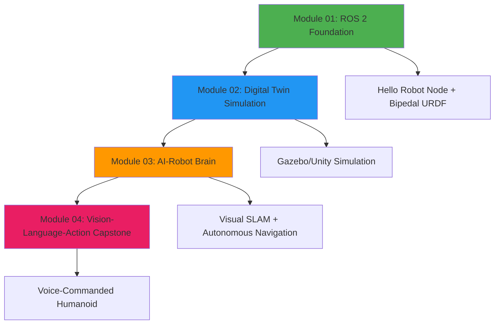

# Implementation Guide: Physical AI & Humanoid Robotics Textbook

**Purpose**: This guide provides step-by-step instructions and starter templates to implement the textbook using the task breakdown in `specs/001-textbook-content-modules/tasks.md`.

**Strategy**: MVP First - Complete Phase 1 (Setup) + Phase 2 (Foundational) + Phase 3 (Module 01) to deliver learner value immediately.

---

## Quick Start (5 Minutes)

### 1. Initialize Docusaurus Project

```bash
cd "C:\Users\LAPTOOL TECHNOLOGY\Desktop\book"

# Initialize Docusaurus (choose "classic" preset when prompted)
npx create-docusaurus@latest . classic --typescript

# Install Mermaid plugin for diagrams
npm install --save @docusaurus/theme-mermaid

# Start development server
npm start
```

**Expected**: Browser opens at `http://localhost:3000` with default Docusaurus site.

---

## Phase 1: Setup (Tasks T001-T007)

### Task T001: ✅ Initialize Docusaurus
- Run the Quick Start commands above

### Task T002: Configure docusaurus.config.js

**File**: `docusaurus.config.js`

Replace the default config with this template:

```javascript
// @ts-check
// Note: type annotations allow type checking and IDEs autocompletion

const {themes} = require('prism-react-renderer');
const lightTheme = themes.github;
const darkTheme = themes.dracula;

/** @type {import('@docusaurus/types').Config} */
const config = {
  title: 'Physical AI & Humanoid Robotics',
  tagline: 'AI-Native Textbook for the Future of Work',
  favicon: 'img/favicon.ico',

  // Set the production url of your site here
  url: 'https://YOUR_USERNAME.github.io',
  // Set the /<baseUrl>/ pathname under which your site is served
  baseUrl: '/book/',

  // GitHub pages deployment config
  organizationName: 'YOUR_USERNAME', // Usually your GitHub org/user name.
  projectName: 'book', // Usually your repo name.

  onBrokenLinks: 'throw',
  onBrokenMarkdownLinks: 'warn',

  i18n: {
    defaultLocale: 'en',
    locales: ['en'],
  },

  presets: [
    [
      'classic',
      /** @type {import('@docusaurus/preset-classic').Options} */
      ({
        docs: {
          sidebarPath: require.resolve('./sidebars.js'),
          routeBasePath: '/', // Serve docs at site root
        },
        blog: false, // Disable blog
        theme: {
          customCss: require.resolve('./src/css/custom.css'),
        },
      }),
    ],
  ],

  markdown: {
    mermaid: true,
  },
  themes: ['@docusaurus/theme-mermaid'],

  themeConfig:
    /** @type {import('@docusaurus/preset-classic').ThemeConfig} */
    ({
      navbar: {
        title: 'Physical AI & Humanoid Robotics',
        items: [
          {
            type: 'docSidebar',
            sidebarId: 'tutorialSidebar',
            position: 'left',
            label: 'Modules',
          },
          {
            href: 'https://github.com/YOUR_USERNAME/book',
            label: 'GitHub',
            position: 'right',
          },
        ],
      },
      footer: {
        style: 'dark',
        links: [
          {
            title: 'Modules',
            items: [
              {
                label: 'Module 01: ROS 2 Foundation',
                to: '/01-robotic-nervous-system',
              },
              {
                label: 'Module 02: Digital Twin',
                to: '/02-digital-twin',
              },
              {
                label: 'Module 03: AI-Robot Brain',
                to: '/03-ai-robot-brain',
              },
              {
                label: 'Module 04: Vision-Language-Action',
                to: '/04-vision-language-action',
              },
            ],
          },
          {
            title: 'Resources',
            items: [
              {
                label: 'ROS 2 Documentation',
                href: 'https://docs.ros.org/en/humble/',
              },
              {
                label: 'NVIDIA Isaac',
                href: 'https://developer.nvidia.com/isaac-ros',
              },
            ],
          },
        ],
        copyright: `Copyright © ${new Date().getFullYear()} Physical AI & Humanoid Robotics. Built with Docusaurus.`,
      },
      prism: {
        theme: lightTheme,
        darkTheme: darkTheme,
        additionalLanguages: ['python', 'cpp', 'yaml', 'xml', 'bash'],
      },
    }),
};

module.exports = config;
```

### Task T003-T004: ✅ Mermaid Plugin
- Already installed above with `npm install --save @docusaurus/theme-mermaid`
- Configuration added to `docusaurus.config.js`

### Task T005: Configure sidebars.js

**File**: `sidebars.js`

```javascript
/**
 * Creating a sidebar enables you to:
 - create an ordered group of docs
 - render a sidebar for each doc of that group
 - provide next/previous navigation

 The sidebars can be generated from the filesystem, or explicitly defined here.

 Create as many sidebars as you want.
 */

// @ts-check

/** @type {import('@docusaurus/plugin-content-docs').SidebarsConfig} */
const sidebars = {
  tutorialSidebar: [
    {
      type: 'doc',
      id: 'intro',
      label: 'Introduction',
    },
    {
      type: 'category',
      label: 'Module 01: ROS 2 Foundation',
      link: {
        type: 'doc',
        id: '01-robotic-nervous-system/index',
      },
      items: [
        '01-robotic-nervous-system/01-ros2-architecture',
        '01-robotic-nervous-system/02-python-bridging',
        '01-robotic-nervous-system/03-urdf-anatomy',
        '01-robotic-nervous-system/04-hello-robot',
        '01-robotic-nervous-system/05-bipedal-urdf',
        '01-robotic-nervous-system/06-checkpoint',
      ],
    },
    {
      type: 'category',
      label: 'Module 02: Digital Twin',
      link: {
        type: 'doc',
        id: '02-digital-twin/index',
      },
      items: [
        '02-digital-twin/01-gazebo-physics',
        '02-digital-twin/02-unity-rendering',
        '02-digital-twin/03-sensor-simulation',
        '02-digital-twin/04-spawn-robot',
        '02-digital-twin/05-sensor-streams',
        '02-digital-twin/06-checkpoint',
      ],
    },
    {
      type: 'category',
      label: 'Module 03: AI-Robot Brain',
      link: {
        type: 'doc',
        id: '03-ai-robot-brain/index',
      },
      items: [
        '03-ai-robot-brain/01-isaac-sim-intro',
        '03-ai-robot-brain/02-visual-slam',
        '03-ai-robot-brain/03-nav2-planning',
        '03-ai-robot-brain/04-synthetic-data',
        '03-ai-robot-brain/05-mapping',
        '03-ai-robot-brain/06-autonomous-nav',
        '03-ai-robot-brain/07-checkpoint',
      ],
    },
    {
      type: 'category',
      label: 'Module 04: Vision-Language-Action',
      link: {
        type: 'doc',
        id: '04-vision-language-action/index',
      },
      items: [
        '04-vision-language-action/01-voice-pipeline',
        '04-vision-language-action/02-llm-reasoning',
        '04-vision-language-action/03-ros2-actions',
        '04-vision-language-action/04-whisper-setup',
        '04-vision-language-action/05-llm-integration',
        '04-vision-language-action/06-autonomous-humanoid',
        '04-vision-language-action/07-checkpoint',
      ],
    },
  ],
};

module.exports = sidebars;
```

### Task T006: Create .gitignore

**File**: `.gitignore`

```gitignore
# Dependencies
node_modules/
package-lock.json
yarn.lock
pnpm-lock.yaml

# Production
build/
.docusaurus/
.cache-loader

# Generated files
.DS_Store
Thumbs.db

# IDE
.vscode/
.idea/
*.swp
*.swo
*~

# Logs
npm-debug.log*
yarn-debug.log*
yarn-error.log*
lerna-debug.log*

# Env files
.env
.env.local
.env.development.local
.env.test.local
.env.production.local

# Temporary files
*.tmp
*.temp
```

### Task T007: ✅ Create static directories
- Already created with Docusaurus initialization
- `static/img/` and `static/code/` ready for assets

---

## Phase 2: Foundational (Tasks T008-T012)

### Task T008: ✅ Create docs/ directory
- Already created by Docusaurus initialization

### Task T009: Create Homepage (docs/intro.md)

**File**: `docs/intro.md`

```markdown
---
id: intro
title: Welcome to Physical AI & Humanoid Robotics
sidebar_label: Introduction
sidebar_position: 0
description: AI-Native textbook covering ROS 2, simulation, NVIDIA Isaac, and Vision-Language-Action integration for humanoid robotics
keywords: [physical ai, humanoid robotics, ros 2, nvidia isaac, vla, ai-native learning]
---

# Physical AI & Humanoid Robotics

**An AI-Native Textbook for the Future of Work**

Welcome to the comprehensive curriculum designed to teach the intersection of **artificial intelligence, software agents, and physical robotics**. This textbook emphasizes the partnership between humans, AI agents, and humanoid robots—preparing you for careers in the rapidly evolving field of Physical AI.

---

## Learning Path



---

## Course Overview

### Module 01: The Robotic Nervous System (ROS 2)

**Duration**: ~3 hours | **Priority**: P1 (MVP)

Establish the middleware foundation for robot control using **ROS 2 Humble**. Learn how nodes, topics, services, and actions enable communication between AI agents and robot hardware.

**Deliverable**: Create a "Hello Robot" node and build a 6-DOF bipedal URDF model visualized in RViz.

[Start Module 01 →](01-robotic-nervous-system/index.md)

---

### Module 02: The Digital Twin (Gazebo & Unity)

**Duration**: ~4 hours | **Priority**: P2

Master physics simulation and high-fidelity environment building with **Gazebo** and **Unity**. Configure sensor plugins (LiDAR, depth cameras, IMU) and access real-time data streams.

**Deliverable**: A simulation environment where robots spawn with realistic physics and sensor data flows to ROS 2 topics.

[Start Module 02 →](02-digital-twin/index.md)

---

### Module 03: The AI-Robot Brain (NVIDIA Isaac)

**Duration**: ~5 hours | **Priority**: P3

Implement advanced perception and Visual SLAM using **NVIDIA Isaac Sim** and **Isaac ROS**. Configure **Nav2** for bipedal path planning and autonomous navigation.

**Deliverable**: A robot that generates synthetic training data, maps a room, and autonomously navigates from point A to B.

[Start Module 03 →](03-ai-robot-brain/index.md)

---

### Module 04: Vision-Language-Action (VLA)

**Duration**: ~6 hours | **Priority**: P4 (Capstone)

Build the complete **Human-Agent-Robot Symbiosis** pipeline. Integrate **OpenAI Whisper** for voice transcription, **LLMs** for reasoning, and **ROS 2** for robot execution.

**Deliverable**: "The Autonomous Humanoid" - a voice-commanded robot that translates natural language into physical actions.

[Start Module 04 →](04-vision-language-action/index.md)

---

## Prerequisites

Before starting this curriculum, ensure you have:

- **Python 3.10+** installed with basic programming knowledge (variables, functions, loops)
- **Ubuntu 22.04 LTS** environment (native, VM, or WSL2 for Windows users)
- **8GB RAM minimum** (16GB recommended for Module 03)
- **Basic command-line proficiency** (cd, ls, mkdir, running scripts)

**Optional for Module 03**:
- **NVIDIA GPU** with 6GB VRAM for Isaac Sim (alternatives provided for CPU-only systems)

---

## Learning Approach

This textbook follows **AI-Native Pedagogy** principles:

✅ **Practical Rigor**: Every concept includes executable code examples with setup instructions, run commands, and expected outputs

✅ **Human-Agent-Robot Symbiosis**: Content demonstrates how humans guide, AI agents orchestrate, and robots execute

✅ **Modular Structure**: Each module is self-contained with clear learning objectives and prerequisites

✅ **Future-Ready Skills**: Aligned with Panaversity's "Future of Work" demands—agentic AI, humanoid robotics, edge computing

---

## How to Use This Textbook

1. **Sequential Learning**: Complete modules in order (01 → 02 → 03 → 04) for best experience
2. **Hands-On Practice**: Run every code example locally—learning happens through doing
3. **Checkpoint Validation**: Complete validation exercises at the end of each module
4. **AI-Assisted Study**: Use Claude Code/Agents to navigate content, ask questions, and debug issues

---

## Support & Resources

- **ROS 2 Documentation**: [docs.ros.org/en/humble](https://docs.ros.org/en/humble/)
- **NVIDIA Isaac**: [developer.nvidia.com/isaac-ros](https://developer.nvidia.com/isaac-ros)
- **Gazebo**: [gazebosim.org](https://gazebosim.org/)
- **Docusaurus**: [docusaurus.io](https://docusaurus.io/)

---

## Ready to Begin?

Start with **Module 01: The Robotic Nervous System** to build your foundation in ROS 2 middleware.

[Begin Learning →](01-robotic-nervous-system/index.md)
```

### Task T010: Create static/code/README.md

**File**: `static/code/README.md`

```markdown
# Code Bundles

This directory contains downloadable code examples for each module.

## Structure

```
code/
├── module01-hello-robot/       # ROS 2 Hello Robot node package
├── module01-bipedal-urdf/      # 6-DOF bipedal URDF model with meshes
├── module02-gazebo-world/      # Gazebo world files and launch scripts
├── module02-unity-project/     # Unity project with ROS-TCP-Connector
├── module03-isaac-config/      # Isaac Sim Docker config and params
├── module03-nav2-config/       # Nav2 bipedal configuration files
└── module04-vla-pipeline/      # Complete VLA pipeline (Whisper + LLM + ROS 2)
```

## Usage

Each bundle includes:
- **README.md**: Setup instructions and prerequisites
- **Source code**: Fully commented Python/C++ files
- **Configuration files**: YAML, XML, launch files
- **Expected outputs**: Sample console outputs for validation

## Testing Code Examples

All code examples are tested on:
- **OS**: Ubuntu 22.04 LTS
- **ROS 2**: Humble Hawksbill
- **Python**: 3.10+

Refer to individual module pages for specific setup instructions.
```

### Task T011: GitHub Actions Workflow

**File**: `.github/workflows/deploy.yml`

```yaml
name: Deploy to GitHub Pages

on:
  push:
    branches:
      - main
  pull_request:
    branches:
      - main

jobs:
  deploy:
    name: Deploy to GitHub Pages
    runs-on: ubuntu-latest
    steps:
      - uses: actions/checkout@v3
      - uses: actions/setup-node@v3
        with:
          node-version: 18
          cache: npm

      - name: Install dependencies
        run: npm ci

      - name: Build website
        run: npm run build

      - name: Deploy to GitHub Pages
        uses: peaceiris/actions-gh-pages@v3
        if: github.ref == 'refs/heads/main'
        with:
          github_token: ${{ secrets.GITHUB_TOKEN }}
          publish_dir: ./build
          user_name: github-actions[bot]
          user_email: 41898282+github-actions[bot]@users.noreply.github.com
```

### Task T012: Configure package.json scripts

**Modify** `package.json` to ensure these scripts exist:

```json
{
  "scripts": {
    "docusaurus": "docusaurus",
    "start": "docusaurus start",
    "build": "docusaurus build",
    "swizzle": "docusaurus swizzle",
    "deploy": "docusaurus deploy",
    "clear": "docusaurus clear",
    "serve": "docusaurus serve",
    "write-translations": "docusaurus write-translations",
    "write-heading-ids": "docusaurus write-heading-ids"
  }
}
```

---

## Next Steps

After completing Phase 1 and Phase 2:

1. **Test the setup**: Run `npm start` and verify the homepage appears
2. **Begin Module 01**: Create content pages using the templates in Phase 3
3. **Validate**: Run `npm run build` to check for errors
4. **Deploy**: Push to GitHub and enable GitHub Pages

For detailed Module 01 content templates, see **Phase 3** section below (create files in `docs/01-robotic-nervous-system/`).

---

## Module 01 Content Templates

See the next sections for complete Module 01 page templates ready to use.
