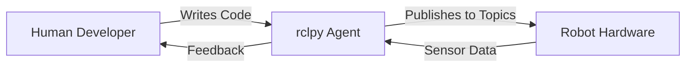
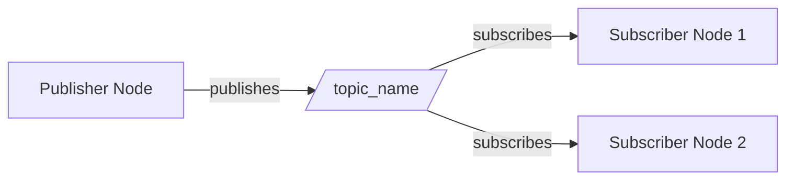
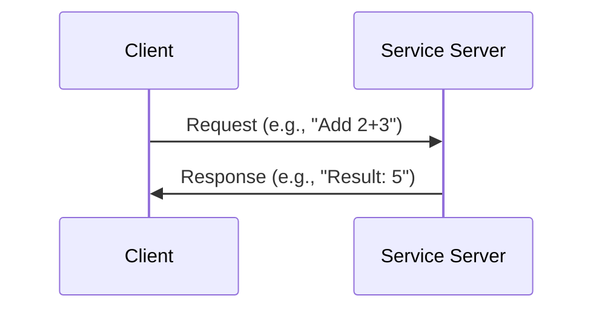
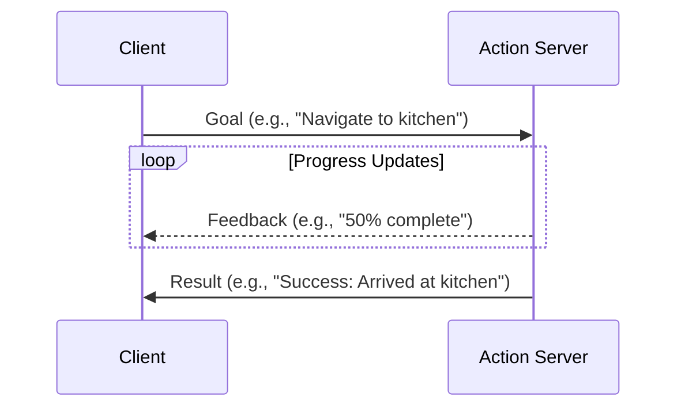
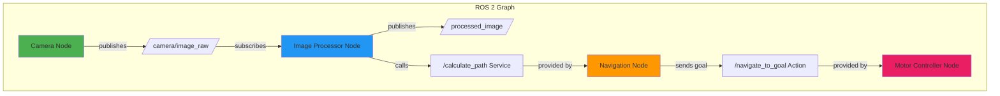

# Module 01: Content Templates

These are production-ready templates for Module 01 pages. Create files in `docs/01-robotic-nervous-system/` directory.

---

## File: docs/01-robotic-nervous-system/index.md

```markdown
---
id: index
title: "Module 01: The Robotic Nervous System (ROS 2)"
sidebar_label: "Overview"
sidebar_position: 0
description: "Establish the middleware foundation for robot control using ROS 2 architecture, Python bridging, and URDF modeling."
keywords: [ros 2, rclpy, urdf, nodes, topics, services, actions, middleware]
---

# Module 01: The Robotic Nervous System (ROS 2)

## Overview

Welcome to **Module 01**! In this module, you'll learn the foundational middleware layer that enables communication between AI agents and physical robots. **ROS 2 (Robot Operating System 2)** is the industry-standard framework for building robotics applications.

---

## Learning Objectives

By completing this module, you will be able to:

✅ **Create ROS 2 nodes** that publish and subscribe to topics
✅ **Call ROS 2 services** and trigger actions from Python code
✅ **Build and visualize** a bipedal URDF model in RViz
✅ **Explain ROS 2 architecture** (nodes, topics, services, actions) with practical examples

---

## Prerequisites

Before starting this module:

- ✅ **Python 3.10+** installed with basic programming knowledge
- ✅ **Ubuntu 22.04 LTS** environment (native, VM, or WSL2)
- ✅ **ROS 2 Humble** installed ([installation guide](https://docs.ros.org/en/humble/Installation.html))
- ✅ **Basic command-line proficiency**

:::tip System Check
Verify ROS 2 installation:
```bash
source /opt/ros/humble/setup.bash
ros2 --version
```
Expected output: `ros2 cli version x.x.x`
:::

---

## Module Structure

This module contains 6 pages:

| Page | Topic | Type |
|------|-------|------|
| 01 | ROS 2 Architecture | Concept |
| 02 | Python Bridging with rclpy | Concept |
| 03 | URDF Anatomy | Concept |
| 04 | Hello Robot Node | Hands-On |
| 05 | Bipedal URDF Model | Hands-On |
| 06 | Checkpoint | Validation |

---

## Module Deliverable

By the end of this module, you will create:

### 1. Hello Robot Node
A functional ROS 2 node that:
- Publishes "Hello, Robot!" messages to a topic every second
- Demonstrates publisher-subscriber communication
- Logs activity to the console

### 2. Bipedal URDF Model
A 6-DOF humanoid robot model with:
- Torso, left/right legs, head
- 6 joints (2 hips, 2 knees, 1 neck, 1 head pivot)
- Visual meshes for 3D visualization
- Verified to load in RViz without errors

---

## Estimated Completion Time

⏱️ **3 hours** (including hands-on exercises and checkpoint)

---

## Human-Agent-Robot Symbiosis in Module 01

This module demonstrates the partnership model:

- **Human**: You design robot behavior (what the robot should do)
- **Agent (rclpy)**: Python code orchestrates communication between components
- **Robot**: Physical hardware receives commands via ROS 2 topics/services



---

## Ready to Start?

Begin with **Page 01: ROS 2 Architecture** to understand the core communication patterns.

[Continue to ROS 2 Architecture →](01-ros2-architecture.md)
```

---

## File: docs/01-robotic-nervous-system/01-ros2-architecture.md

```markdown
---
title: "ROS 2 Architecture"
description: "Learn the core communication patterns in ROS 2: nodes, topics, services, and actions."
keywords: [ros 2, nodes, topics, services, actions, publisher, subscriber, middleware]
sidebar_position: 1
---

# ROS 2 Architecture

## Introduction

**ROS 2 (Robot Operating System 2)** is a middleware framework that enables communication between software components in robotics systems. Think of it as the **nervous system** of a robot—connecting sensors, actuators, AI logic, and human interfaces.

---

## Core Concepts

### 1. Nodes

**Nodes** are the basic execution units in ROS 2. Each node is a separate process responsible for a specific task.

**Examples**:
- Camera node: Captures images and publishes them
- Navigation node: Plans paths and sends movement commands
- Logging node: Records data for debugging

:::tip Best Practice
Keep nodes **single-purpose**. One node should do one thing well (e.g., read sensor data OR process images, not both).
:::

---

### 2. Topics (Publish-Subscribe)

**Topics** enable **one-to-many** or **many-to-many** asynchronous communication. Publishers send messages, subscribers receive them.

**Use Cases**:
- Streaming sensor data (e.g., camera images at 30 FPS)
- Broadcasting robot state (position, velocity)
- Continuous data flows where timing isn't critical

**Communication Pattern**:



**Key Characteristics**:
- **Asynchronous**: Publishers don't wait for subscribers
- **Many-to-Many**: Multiple publishers/subscribers can share a topic
- **Fire-and-Forget**: No response expected from subscribers

---

### 3. Services (Request-Reply)

**Services** enable **one-to-one** synchronous communication. Clients send requests, servers respond.

**Use Cases**:
- Triggering calculations (e.g., "Plan a path from A to B")
- Querying robot state (e.g., "What's your current battery level?")
- One-time actions where you need a response

**Communication Pattern**:



**Key Characteristics**:
- **Synchronous**: Client waits for response
- **One-to-One**: One client request → one server response
- **Blocking**: Client pauses execution until response arrives

---

### 4. Actions (Goal-Feedback-Result)

**Actions** enable **long-running tasks** with progress feedback and cancellation support.

**Use Cases**:
- Navigation to a goal pose (may take minutes)
- Robot arm pick-and-place sequences
- Any task where you need progress updates

**Communication Pattern**:



**Key Characteristics**:
- **Asynchronous with Feedback**: Client receives progress updates
- **Cancellable**: Client can cancel in-progress goals
- **Preemptable**: New goals can override old ones

---

## Comparison Table

| Feature | Topics | Services | Actions |
|---------|--------|----------|---------|
| **Communication** | Many-to-Many | One-to-One | One-to-One |
| **Timing** | Asynchronous | Synchronous | Asynchronous |
| **Response** | None | Immediate | Eventual (with feedback) |
| **Use Case** | Streaming data | Quick queries | Long-running tasks |
| **Cancellable** | No | No | Yes |

---

## ROS 2 Architecture Diagram



---

## Real-World Example: Autonomous Delivery Robot

Let's see how all three communication patterns work together:

**Scenario**: A robot navigates to deliver a package.

1. **Topics**:
   - `/camera/image` - Camera publishes images at 30 Hz
   - `/lidar/scan` - LiDAR publishes obstacle data at 10 Hz
   - `/robot/pose` - Robot broadcasts its position continuously

2. **Services**:
   - `/plan_path` - Request: Start & Goal poses → Response: Planned path
   - `/check_battery` - Request: Empty → Response: Battery percentage

3. **Actions**:
   - `/navigate_to_goal` - Goal: Target pose → Feedback: Distance remaining → Result: Success/Failure

---

## Key Takeaways

✅ **Nodes** are independent processes—each does one thing well
✅ **Topics** stream continuous data (sensors, state updates)
✅ **Services** handle quick request-reply interactions
✅ **Actions** manage long-running tasks with feedback
✅ **Choose based on timing**: Asynchronous → Topics/Actions, Synchronous → Services

---

## Next Steps

Now that you understand ROS 2 architecture, let's learn how to **implement these patterns in Python** using the `rclpy` library.

[Continue to Python Bridging →](02-python-bridging.md)
```

---

## File: docs/01-robotic-nervous-system/04-hello-robot.md

```markdown
---
title: "Hands-On: Hello Robot Node"
description: "Create your first ROS 2 publisher node that sends messages to a topic using Python and rclpy."
keywords: [ros 2, rclpy, publisher, hello robot, hands-on, python, node]
sidebar_position: 4
---

# Hands-On: Create a Hello Robot Node

## Objective

Build a **ROS 2 publisher node** that publishes "Hello, Robot!" messages to a topic every second. This demonstrates the core publish-subscribe pattern in ROS 2.

---

## Prerequisites

- ✅ Completed Pages 01-03 (ROS 2 architecture, Python bridging, URDF anatomy)
- ✅ ROS 2 Humble installed and sourced
- ✅ Basic Python knowledge

---

## Step 1: Create ROS 2 Workspace

```bash
# Create workspace directory
mkdir -p ~/ros2_ws/src
cd ~/ros2_ws/src

# Create a Python package
ros2 pkg create --build-type ament_python hello_robot \
  --dependencies rclpy std_msgs

cd hello_robot
```

**Expected Output**:
```
going to create a new package
package name: hello_robot
destination directory: /home/user/ros2_ws/src
package format: 3
...
```

---

## Step 2: Write the Hello Robot Node

**File**: `~/ros2_ws/src/hello_robot/hello_robot/hello_robot_node.py`

```python
import rclpy
from rclpy.node import Node
from std_msgs.msg import String


class HelloRobotNode(Node):
    """
    A simple ROS 2 publisher node that sends "Hello, Robot!" messages.

    This demonstrates:
    - Creating a ROS 2 node
    - Publishing messages to a topic
    - Using timers for periodic execution
    """

    def __init__(self):
        # Initialize the node with name 'hello_robot'
        super().__init__('hello_robot')

        # Create a publisher
        # - Message type: String (from std_msgs)
        # - Topic name: 'hello_topic'
        # - Queue size: 10 (buffer for messages)
        self.publisher = self.create_publisher(String, 'hello_topic', 10)

        # Create a timer that calls publish_message() every 1.0 seconds
        self.timer = self.create_timer(1.0, self.publish_message)

        # Log startup message
        self.get_logger().info('Hello Robot Node started!')

    def publish_message(self):
        """
        Callback function executed by the timer.
        Creates and publishes a "Hello, Robot!" message.
        """
        msg = String()
        msg.data = 'Hello, Robot!'

        # Publish the message
        self.publisher.publish(msg)

        # Log what was published
        self.get_logger().info(f'Published: "{msg.data}"')


def main(args=None):
    """
    Main entry point for the node.
    """
    # Initialize the ROS 2 Python client library
    rclpy.init(args=args)

    # Create the node
    node = HelloRobotNode()

    # Keep the node running (press Ctrl+C to stop)
    try:
        rclpy.spin(node)
    except KeyboardInterrupt:
        pass

    # Clean shutdown
    node.destroy_node()
    rclpy.shutdown()


if __name__ == '__main__':
    main()
```

---

## Step 3: Update setup.py

**File**: `~/ros2_ws/src/hello_robot/setup.py`

Add the entry point for your node:

```python
entry_points={
    'console_scripts': [
        'hello_robot_node = hello_robot.hello_robot_node:main',
    ],
},
```

Full `setup.py` should look like:

```python
from setuptools import setup

package_name = 'hello_robot'

setup(
    name=package_name,
    version='0.0.1',
    packages=[package_name],
    data_files=[
        ('share/ament_index/resource_index/packages',
            ['resource/' + package_name]),
        ('share/' + package_name, ['package.xml']),
    ],
    install_requires=['setuptools'],
    zip_safe=True,
    maintainer='your_name',
    maintainer_email='your_email@example.com',
    description='A simple Hello Robot ROS 2 publisher node',
    license='Apache License 2.0',
    tests_require=['pytest'],
    entry_points={
        'console_scripts': [
            'hello_robot_node = hello_robot.hello_robot_node:main',
        ],
    },
)
```

---

## Step 4: Build the Package

```bash
cd ~/ros2_ws

# Build the package
colcon build --packages-select hello_robot

# Source the workspace
source install/setup.bash
```

**Expected Output**:
```
Starting >>> hello_robot
Finished <<< hello_robot [0.52s]

Summary: 1 package finished [0.75s]
```

---

## Step 5: Run the Hello Robot Node

### Terminal 1: Run the Publisher

```bash
source ~/ros2_ws/install/setup.bash
ros2 run hello_robot hello_robot_node
```

**Expected Output**:
```
[INFO] [hello_robot]: Hello Robot Node started!
[INFO] [hello_robot]: Published: "Hello, Robot!"
[INFO] [hello_robot]: Published: "Hello, Robot!"
[INFO] [hello_robot]: Published: "Hello, Robot!"
...
```

:::tip Success!
If you see the log messages above, your publisher is working! Press `Ctrl+C` to stop.
:::

---

## Step 6: Verify with ros2 topic

### Terminal 2: Echo the Topic

```bash
source ~/ros2_ws/install/setup.bash
ros2 topic echo /hello_topic
```

**Expected Output**:
```
data: 'Hello, Robot!'
---
data: 'Hello, Robot!'
---
data: 'Hello, Robot!'
---
```

You should see the messages being published in real-time!

---

## Step 7: Inspect with ros2 CLI Tools

### List Active Topics

```bash
ros2 topic list
```

**Expected**:
```
/hello_topic
/parameter_events
/rosout
```

### Get Topic Info

```bash
ros2 topic info /hello_topic
```

**Expected**:
```
Type: std_msgs/msg/String
Publisher count: 1
Subscription count: 0
```

### Check Topic Frequency

```bash
ros2 topic hz /hello_topic
```

**Expected**:
```
average rate: 1.000
    min: 1.000s max: 1.000s std dev: 0.00001s window: 10
```

---

## Understanding the Code

### Key Components

1. **Node Initialization**
   ```python
   super().__init__('hello_robot')
   ```
   Creates a node named `hello_robot` in the ROS 2 graph.

2. **Publisher Creation**
   ```python
   self.publisher = self.create_publisher(String, 'hello_topic', 10)
   ```
   - `String`: Message type from `std_msgs`
   - `'hello_topic'`: Topic name (must start with `/` in ROS 2)
   - `10`: Queue size (buffers up to 10 messages if subscriber is slow)

3. **Timer Setup**
   ```python
   self.timer = self.create_timer(1.0, self.publish_message)
   ```
   Calls `publish_message()` every 1.0 seconds automatically.

4. **Message Publishing**
   ```python
   msg = String()
   msg.data = 'Hello, Robot!'
   self.publisher.publish(msg)
   ```
   Creates a message, sets its content, and publishes it.

---

## Deliverable Checkpoint

✅ **Verify Your Hello Robot Node**:

1. Node runs without errors
2. Logs show "Published: Hello, Robot!" every second
3. `ros2 topic echo /hello_topic` displays messages
4. Topic frequency is ~1 Hz (`ros2 topic hz /hello_topic`)

---

## Troubleshooting

### Issue: "ModuleNotFoundError: No module named 'hello_robot'"

**Solution**: Make sure you sourced the workspace:
```bash
source ~/ros2_ws/install/setup.bash
```

### Issue: "No executable found"

**Solution**: Check `setup.py` has the correct entry point and rebuild:
```bash
colcon build --packages-select hello_robot --symlink-install
```

### Issue: Messages not appearing

**Solution**: Verify both terminals have sourced ROS 2 and your workspace:
```bash
source /opt/ros/humble/setup.bash
source ~/ros2_ws/install/setup.bash
```

---

## Challenge: Create a Subscriber

**Task**: Modify the code to create a **subscriber node** that listens to `/hello_topic` and logs received messages.

**Hint**: Use `self.create_subscription()` and implement a callback function.

---

## Downloadable Code

Complete working example available in:
[`static/code/module01-hello-robot/`](../../static/code/module01-hello-robot/)

---

## Next Steps

Now that you've built a ROS 2 publisher, let's create a **bipedal URDF model** to visualize a humanoid robot in RViz.

[Continue to Bipedal URDF →](05-bipedal-urdf.md)
```

---

## Additional Templates

For the remaining Module 01 pages:
- **02-python-bridging.md**: Document rclpy API (Node class, create_publisher, create_subscription, create_service, create_client)
- **03-urdf-anatomy.md**: Explain URDF XML structure with humanoid skeleton diagram
- **05-bipedal-urdf.md**: Step-by-step 6-DOF URDF creation with RViz visualization
- **06-checkpoint.md**: Validation exercises (multiple choice, coding challenges, deliverable verification)

Use the same frontmatter structure and follow the code-example-template.md pattern for hands-on sections.

---

## Static Assets

### Create Mermaid Diagrams

Diagrams are embedded directly in Markdown using ` ```mermaid ` fences (see examples in templates above).

### Create Code Bundles

**Directory**: `static/code/module01-hello-robot/`

Place the complete Hello Robot package files:
- `hello_robot_node.py` (full source)
- `package.xml`
- `setup.py`
- `README.md` (setup instructions)

**Directory**: `static/code/module01-bipedal-urdf/`

Place URDF files:
- `simple_humanoid.urdf` (6-DOF robot description)
- `meshes/` directory with STL files
- `README.md` (visualization instructions)

---

## Testing Checklist

Before deployment:

- [ ] Run `npm start` - homepage appears
- [ ] Module 01 pages render correctly
- [ ] Mermaid diagrams display
- [ ] Code blocks have syntax highlighting
- [ ] Internal links work (no 404s)
- [ ] Run `npm run build` - zero errors
- [ ] Frontmatter valid on all pages

---

## Deployment

```bash
# Build for production
npm run build

# Deploy to GitHub Pages
npm run deploy
```

Site will be live at: `https://YOUR_USERNAME.github.io/book/`
