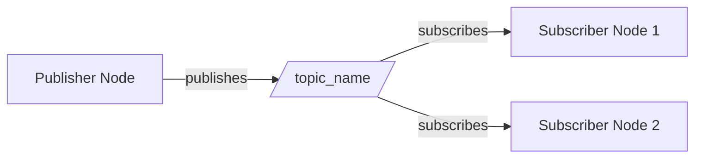
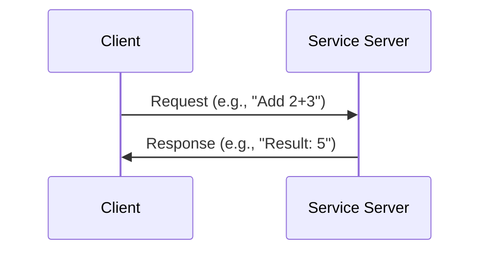
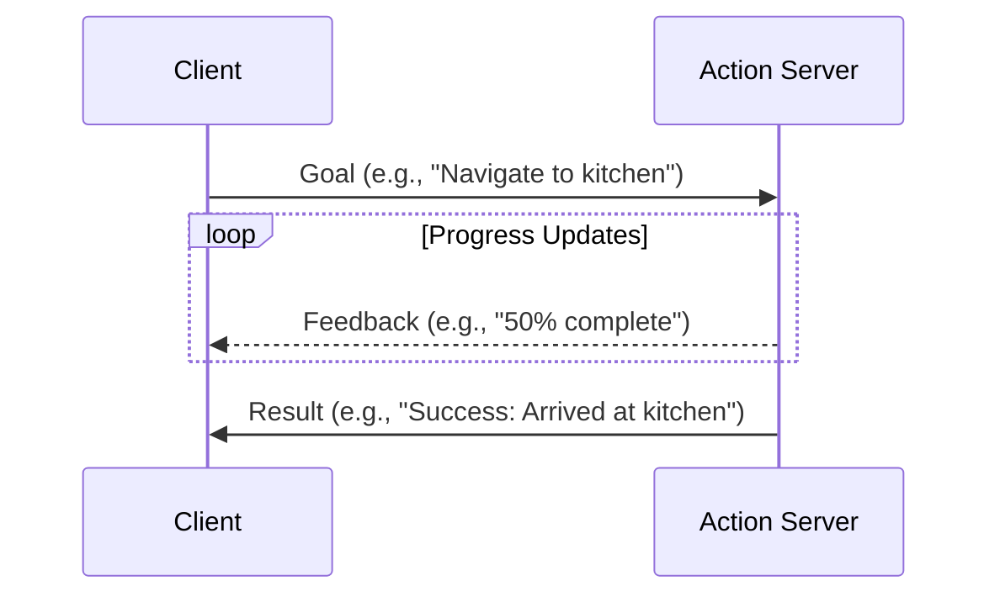
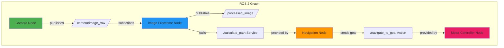

# ROS 2 Architecture

## Introduction

**ROS 2 (Robot Operating System 2)** is a middleware framework that enables communication between software components in robotics systems. Think of it as the **nervous system** of a robot—connecting sensors, actuators, AI logic, and human interfaces.

---

## Core Concepts

### 1. Nodes

**Nodes** are the basic execution units in ROS 2. Each node is a separate process responsible for a specific task.

**Examples**:
- Camera node: Captures images and publishes them
- Navigation node: Plans paths and sends movement commands
- Logging node: Records data for debugging

:::tip Best Practice
Keep nodes **single-purpose**. One node should do one thing well (e.g., read sensor data OR process images, not both).
:::

---

### 2. Topics (Publish-Subscribe)

**Topics** enable **one-to-many** or **many-to-many** asynchronous communication. Publishers send messages, subscribers receive them.

**Use Cases**:
- Streaming sensor data (e.g., camera images at 30 FPS)
- Broadcasting robot state (position, velocity)
- Continuous data flows where timing isn't critical

**Communication Pattern**:

**Key Characteristics**:
- **Asynchronous**: Publishers don't wait for subscribers
- **Many-to-Many**: Multiple publishers/subscribers can share a topic
- **Fire-and-Forget**: No response expected from subscribers

---

### 3. Services (Request-Reply)

**Services** enable **one-to-one** synchronous communication. Clients send requests, servers respond.

**Use Cases**:
- Triggering calculations (e.g., "Plan a path from A to B")
- Querying robot state (e.g., "What's your current battery level?")
- One-time actions where you need a response

**Communication Pattern**:

**Key Characteristics**:
- **Synchronous**: Client waits for response
- **One-to-One**: One client request → one server response
- **Blocking**: Client pauses execution until response arrives

---

### 4. Actions (Goal-Feedback-Result)

**Actions** enable **long-running tasks** with progress feedback and cancellation support.

**Use Cases**:
- Navigation to a goal pose (may take minutes)
- Robot arm pick-and-place sequences
- Any task where you need progress updates

**Communication Pattern**:

**Key Characteristics**:
- **Asynchronous with Feedback**: Client receives progress updates
- **Cancellable**: Client can cancel in-progress goals
- **Preemptable**: New goals can override old ones

---

## Comparison Table

| Feature | Topics | Services | Actions |
|---------|--------|----------|---------|
| **Communication** | Many-to-Many | One-to-One | One-to-One |
| **Timing** | Asynchronous | Synchronous | Asynchronous |
| **Response** | None | Immediate | Eventual (with feedback) |
| **Use Case** | Streaming data | Quick queries | Long-running tasks |
| **Cancellable** | No | No | Yes |

---

## ROS 2 Architecture Diagram

---

## Real-World Example: Autonomous Delivery Robot

Let's see how all three communication patterns work together:

**Scenario**: A robot navigates to deliver a package.

1. **Topics**:
   - `/camera/image` - Camera publishes images at 30 Hz
   - `/lidar/scan` - LiDAR publishes obstacle data at 10 Hz
   - `/robot/pose` - Robot broadcasts its position continuously

2. **Services**:
   - `/plan_path` - Request: Start & Goal poses → Response: Planned path
   - `/check_battery` - Request: Empty → Response: Battery percentage

3. **Actions**:
   - `/navigate_to_goal` - Goal: Target pose → Feedback: Distance remaining → Result: Success/Failure

---

## Key Takeaways

✅ **Nodes** are independent processes—each does one thing well
✅ **Topics** stream continuous data (sensors, state updates)
✅ **Services** handle quick request-reply interactions
✅ **Actions** manage long-running tasks with feedback
✅ **Choose based on timing**: Asynchronous → Topics/Actions, Synchronous → Services

---

## Next Steps

Now that you understand ROS 2 architecture, let's learn how to **implement these patterns in Python** using the `rclpy` library.

[Continue to Python Bridging →](02-python-bridging.md)
