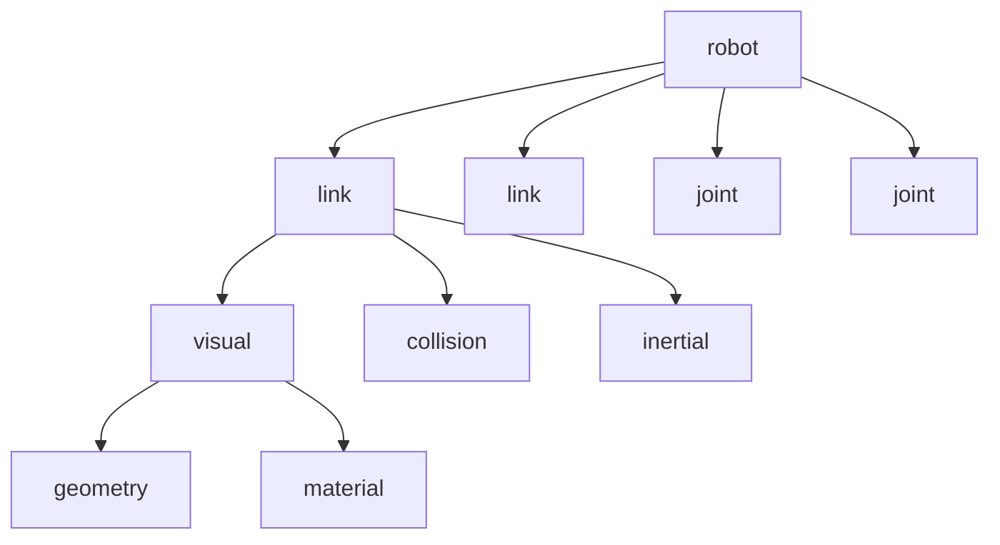

# URDF Anatomy

## Introduction

**URDF (Unified Robot Description Format)** is an XML specification for describing robot structures. It defines the physical and visual properties of robots, including links (rigid bodies), joints (connections between links), collision geometry, and visual meshes.

---

## Why URDF?

### Use Cases

✅ **Visualization**: Display robot models in RViz
✅ **Simulation**: Spawn robots in Gazebo with accurate physics
✅ **Kinematics**: Calculate forward/inverse kinematics
✅ **Collision Detection**: Define collision boundaries
✅ **Sensor Mounting**: Specify sensor positions and orientations

:::tip Standard Format
URDF is the industry standard for ROS robots. Once you create a URDF, it works across all ROS 2 tools (RViz, Gazebo, MoveIt, Nav2).
:::

---

## URDF Structure

### Basic Hierarchy



A URDF file contains:
- **`<robot>`**: Root element with robot name
- **`<link>`**: Rigid bodies (torso, legs, arms, head)
- **`<joint>`**: Connections between links (revolute, prismatic, fixed)
- **`<visual>`**: 3D meshes for display
- **`<collision>`**: Simplified shapes for physics
- **`<inertial>`**: Mass and inertia tensors

---

## Core Elements

### 1. Robot Tag

```xml
<?xml version="1.0"?>
<robot name="simple_humanoid" xmlns:xacro="http://www.ros.org/wiki/xacro">
  <!-- Links and joints go here -->
</robot>
```

**Attributes**:
- `name`: Robot identifier (used in ROS 2 topic namespaces)
- `xmlns:xacro`: Optional namespace for XACRO macros (advanced)

---

### 2. Links

Links represent rigid bodies. Each link has visual, collision, and inertial properties.

```xml
<link name="torso">
  <!-- Visual appearance (what you see in RViz) -->
  <visual>
    <geometry>
      <box size="0.3 0.2 0.5"/>
    </geometry>
    <material name="blue">
      <color rgba="0.0 0.0 1.0 1.0"/>
    </material>
  </visual>

  <!-- Collision shape (for physics simulation) -->
  <collision>
    <geometry>
      <box size="0.3 0.2 0.5"/>
    </geometry>
  </collision>

  <!-- Physical properties (mass, inertia) -->
  <inertial>
    <mass value="10.0"/>
    <inertia ixx="0.4" ixy="0.0" ixz="0.0"
             iyy="0.5" iyz="0.0" izz="0.2"/>
  </inertial>
</link>
```

**Child Elements**:
- **`<visual>`**: Defines appearance (geometry, material, texture)
- **`<collision>`**: Defines collision boundaries (usually simpler than visual)
- **`<inertial>`**: Defines mass distribution (required for physics simulation)

---

### 3. Geometry Types

#### Box

```xml
<geometry>
  <box size="0.3 0.2 0.5"/>  <!-- length_x width_y height_z -->
</geometry>
```

#### Cylinder

```xml
<geometry>
  <cylinder radius="0.05" length="0.4"/>
</geometry>
```

#### Sphere

```xml
<geometry>
  <sphere radius="0.1"/>
</geometry>
```

#### Mesh (STL/DAE/OBJ)

```xml
<geometry>
  <mesh filename="package://my_robot_description/meshes/torso.stl" scale="1.0 1.0 1.0"/>
</geometry>
```

:::tip Mesh Best Practices
- Use **STL** for collision geometry (fast, simple)
- Use **DAE (COLLADA)** for visual meshes (supports textures)
- Keep collision meshes **low-poly** (less than 500 triangles) for performance
:::

---

### 4. Joints

Joints connect two links and define their relative motion.

```xml
<joint name="left_hip_joint" type="revolute">
  <parent link="torso"/>
  <child link="left_thigh"/>
  <origin xyz="0.1 0.0 -0.25" rpy="0 0 0"/>
  <axis xyz="0 1 0"/>
  <limit lower="-1.57" upper="1.57" effort="100" velocity="1.0"/>
</joint>
```

**Attributes**:
- `name`: Joint identifier
- `type`: Joint type (see table below)
- `<parent>`: Parent link name
- `<child>`: Child link name
- `<origin>`: Position (`xyz`) and orientation (`rpy` = roll-pitch-yaw) relative to parent
- `<axis>`: Rotation/translation axis (e.g., `0 1 0` = Y-axis)
- `<limit>`: Joint limits (radians for revolute, meters for prismatic)

---

### Joint Types

| Type | Description | Degrees of Freedom | Example Use |
|------|-------------|-------------------|-------------|
| **fixed** | No motion (welded) | 0 | Camera mount, sensor frame |
| **revolute** | Rotation around axis (1 DOF) | 1 | Hip, knee, elbow |
| **continuous** | Unlimited rotation | 1 | Wheels, turrets |
| **prismatic** | Linear translation | 1 | Elevator, gripper fingers |
| **planar** | 2D translation + rotation | 3 | Mobile base (rarely used) |
| **floating** | 6 DOF (3 translation + 3 rotation) | 6 | Free-floating objects |

---

### 5. Materials

Define colors and textures.

```xml
<material name="red">
  <color rgba="1.0 0.0 0.0 1.0"/>  <!-- Red, Green, Blue, Alpha -->
</material>

<material name="textured">
  <texture filename="package://my_robot_description/textures/metal.png"/>
</material>
```

**RGBA Format**:
- Values range from `0.0` to `1.0`
- `rgba="R G B A"` where A = transparency (1.0 = opaque, 0.0 = transparent)

---

### 6. Inertial Properties

Required for realistic physics simulation.

```xml
<inertial>
  <origin xyz="0 0 0" rpy="0 0 0"/>  <!-- Center of mass -->
  <mass value="5.0"/>  <!-- kg -->
  <inertia ixx="0.1" ixy="0.0" ixz="0.0"
           iyy="0.1" iyz="0.0" izz="0.05"/>  <!-- kg·m² -->
</inertial>
```

**Parameters**:
- `<mass>`: Mass in kilograms
- `<inertia>`: 3x3 inertia tensor (diagonal: ixx, iyy, izz; off-diagonal: ixy, ixz, iyz)

:::danger Common Error
**Missing inertia causes physics simulation failures!** Gazebo will show warnings like:
```
[Wrn] [Physics.cc:414] Inertia matrix is invalid for link [left_leg].
```
Use online calculators or MeshLab to compute inertia from CAD models.
:::

---

## Complete URDF Example: Simple Humanoid Torso

```xml
<?xml version="1.0"?>
<robot name="simple_humanoid">
  <!-- Base link (torso) -->
  <link name="torso">
    <visual>
      <geometry>
        <box size="0.3 0.2 0.5"/>
      </geometry>
      <material name="blue">
        <color rgba="0.0 0.0 0.8 1.0"/>
      </material>
    </visual>
    <collision>
      <geometry>
        <box size="0.3 0.2 0.5"/>
      </geometry>
    </collision>
    <inertial>
      <mass value="10.0"/>
      <inertia ixx="0.4" ixy="0.0" ixz="0.0"
               iyy="0.5" iyz="0.0" izz="0.2"/>
    </inertial>
  </link>

  <!-- Left thigh -->
  <link name="left_thigh">
    <visual>
      <geometry>
        <cylinder radius="0.05" length="0.4"/>
      </geometry>
      <material name="gray">
        <color rgba="0.5 0.5 0.5 1.0"/>
      </material>
    </visual>
    <collision>
      <geometry>
        <cylinder radius="0.05" length="0.4"/>
      </geometry>
    </collision>
    <inertial>
      <mass value="2.0"/>
      <inertia ixx="0.05" ixy="0.0" ixz="0.0"
               iyy="0.05" iyz="0.0" izz="0.01"/>
    </inertial>
  </link>

  <!-- Left hip joint -->
  <joint name="left_hip_joint" type="revolute">
    <parent link="torso"/>
    <child link="left_thigh"/>
    <origin xyz="0.1 0.0 -0.25" rpy="0 0 0"/>
    <axis xyz="0 1 0"/>  <!-- Y-axis rotation -->
    <limit lower="-1.57" upper="1.57" effort="100" velocity="1.0"/>
  </joint>
</robot>
```

---

## Coordinate Frames

### ROS 2 Coordinate Convention

```
     Z (up)
     |
     |
     +------ X (forward)
    /
   /
  Y (left)
```

- **X-axis**: Forward direction (robot's front)
- **Y-axis**: Left direction
- **Z-axis**: Upward direction

:::tip Transform Tree
URDF defines a **transform tree**. ROS 2's `tf2` library broadcasts these transforms at runtime, allowing nodes to query "Where is the camera relative to the base?"
:::

---

## URDF Validation

### Check Syntax

```bash
check_urdf my_robot.urdf
```

**Expected Output**:
```
robot name is: simple_humanoid
---------- Successfully Parsed XML ---------------
root Link: torso has 1 child(ren)
    child(1):  left_thigh
```

### Visualize in RViz

```bash
ros2 launch urdf_tutorial display.launch.py model:=my_robot.urdf
```

### Export URDF Graph

```bash
urdf_to_graphiz my_robot.urdf
```

Generates `my_robot.pdf` with link-joint hierarchy.

---

## Common Patterns

### Pattern 1: Mirrored Links (Left/Right Legs)

```xml
<!-- Right thigh (mirrored from left) -->
<link name="right_thigh">
  <!-- Same visual/collision/inertial as left_thigh -->
</link>

<joint name="right_hip_joint" type="revolute">
  <parent link="torso"/>
  <child link="right_thigh"/>
  <origin xyz="-0.1 0.0 -0.25" rpy="0 0 0"/>  <!-- Negative X for mirroring -->
  <axis xyz="0 1 0"/>
  <limit lower="-1.57" upper="1.57" effort="100" velocity="1.0"/>
</joint>
```

### Pattern 2: Sensor Mounting (Fixed Joints)

```xml
<link name="camera_link">
  <visual>
    <geometry>
      <box size="0.05 0.05 0.02"/>
    </geometry>
  </visual>
</link>

<joint name="camera_joint" type="fixed">
  <parent link="head"/>
  <child link="camera_link"/>
  <origin xyz="0.1 0 0" rpy="0 0 0"/>  <!-- 10cm in front of head -->
</joint>
```

### Pattern 3: Multi-DOF Joints (Neck)

```xml
<!-- Neck pitch (up/down) -->
<joint name="neck_pitch_joint" type="revolute">
  <parent link="torso"/>
  <child link="neck_pitch_link"/>
  <origin xyz="0 0 0.25" rpy="0 0 0"/>
  <axis xyz="0 1 0"/>
  <limit lower="-0.5" upper="0.5" effort="50" velocity="1.0"/>
</joint>

<!-- Neck yaw (left/right) -->
<joint name="neck_yaw_joint" type="revolute">
  <parent link="neck_pitch_link"/>
  <child link="head"/>
  <origin xyz="0 0 0.1" rpy="0 0 0"/>
  <axis xyz="0 0 1"/>
  <limit lower="-1.0" upper="1.0" effort="50" velocity="1.0"/>
</joint>
```

---

## XACRO: Advanced URDF

XACRO (XML Macros) extends URDF with:
- **Macros**: Reusable templates (e.g., leg definition used twice)
- **Properties**: Variables for sizes, colors
- **Math**: Compute values (e.g., `${leg_length * 0.5}`)

```xml
<xacro:property name="leg_radius" value="0.05"/>
<xacro:property name="leg_length" value="0.4"/>

<xacro:macro name="leg" params="prefix reflect">
  <link name="${prefix}_thigh">
    <visual>
      <geometry>
        <cylinder radius="${leg_radius}" length="${leg_length}"/>
      </geometry>
    </visual>
  </link>

  <joint name="${prefix}_hip_joint" type="revolute">
    <parent link="torso"/>
    <child link="${prefix}_thigh"/>
    <origin xyz="${reflect * 0.1} 0 -0.25" rpy="0 0 0"/>
    <axis xyz="0 1 0"/>
    <limit lower="-1.57" upper="1.57" effort="100" velocity="1.0"/>
  </joint>
</xacro:macro>

<!-- Instantiate legs -->
<xacro:leg prefix="left" reflect="1"/>
<xacro:leg prefix="right" reflect="-1"/>
```

Convert XACRO to URDF:
```bash
xacro my_robot.urdf.xacro > my_robot.urdf
```

---

## Key Takeaways

✅ **URDF** is the standard XML format for robot modeling in ROS 2
✅ **Links** define rigid bodies with visual, collision, and inertial properties
✅ **Joints** connect links and define motion (revolute, prismatic, fixed)
✅ **Coordinate frames** follow ROS 2 convention (X forward, Y left, Z up)
✅ **Validation tools** (`check_urdf`, RViz) catch errors before simulation
✅ **XACRO** enables reusable, parameterized robot descriptions

---

## Next Steps

Now that you understand URDF structure, let's create a **hands-on bipedal robot model** and visualize it in RViz!

[Continue to Bipedal URDF →](05-bipedal-urdf.md)
