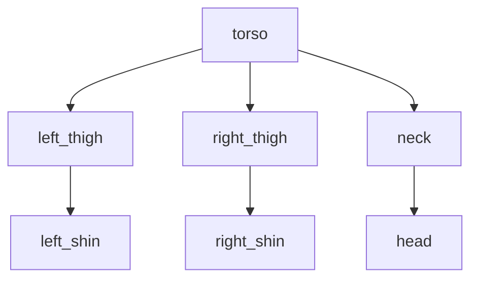

# Hands-On: Build a Bipedal URDF Model

## Objective

Create a **6-degree-of-freedom (6-DOF) bipedal humanoid robot** with:
- 1 torso (base link)
- 2 legs (left/right thighs and shins)
- 1 head with neck joint
- 6 revolute joints (2 hips, 2 knees, 1 neck pitch, 1 head yaw)

Visualize the robot in **RViz** and verify all joints move correctly.

---

## Prerequisites

- ✅ Completed Pages 01-04 (ROS 2 architecture, Python bridging, URDF anatomy, Hello Robot)
- ✅ ROS 2 Humble installed and sourced
- ✅ `urdf_tutorial` package installed:
  ```bash
  sudo apt install ros-humble-urdf-tutorial
  ```

---

## Step 1: Create URDF Package

```bash
cd ~/ros2_ws/src

# Create a new package for robot description
ros2 pkg create --build-type ament_cmake simple_humanoid_description \
  --dependencies urdf

cd simple_humanoid_description
mkdir -p urdf meshes launch
```

**Expected Output**:
```
going to create a new package
package name: simple_humanoid_description
destination directory: /home/user/ros2_ws/src
...
```

---

## Step 2: Write the URDF File

**File**: `~/ros2_ws/src/simple_humanoid_description/urdf/simple_humanoid.urdf`

```xml
<?xml version="1.0"?>
<robot name="simple_humanoid">
  <!-- ==================== MATERIALS ==================== -->
  <material name="blue">
    <color rgba="0.0 0.0 0.8 1.0"/>
  </material>
  <material name="gray">
    <color rgba="0.5 0.5 0.5 1.0"/>
  </material>
  <material name="white">
    <color rgba="0.9 0.9 0.9 1.0"/>
  </material>

  <!-- ==================== TORSO (Base Link) ==================== -->
  <link name="torso">
    <visual>
      <geometry>
        <box size="0.3 0.2 0.5"/>
      </geometry>
      <material name="blue"/>
    </visual>
    <collision>
      <geometry>
        <box size="0.3 0.2 0.5"/>
      </geometry>
    </collision>
    <inertial>
      <mass value="10.0"/>
      <origin xyz="0 0 0" rpy="0 0 0"/>
      <inertia ixx="0.4" ixy="0.0" ixz="0.0"
               iyy="0.5" iyz="0.0" izz="0.2"/>
    </inertial>
  </link>

  <!-- ==================== LEFT LEG ==================== -->
  <!-- Left Thigh -->
  <link name="left_thigh">
    <visual>
      <origin xyz="0 0 -0.2" rpy="0 0 0"/>
      <geometry>
        <cylinder radius="0.05" length="0.4"/>
      </geometry>
      <material name="gray"/>
    </visual>
    <collision>
      <origin xyz="0 0 -0.2" rpy="0 0 0"/>
      <geometry>
        <cylinder radius="0.05" length="0.4"/>
      </geometry>
    </collision>
    <inertial>
      <mass value="2.0"/>
      <origin xyz="0 0 -0.2" rpy="0 0 0"/>
      <inertia ixx="0.05" ixy="0.0" ixz="0.0"
               iyy="0.05" iyz="0.0" izz="0.01"/>
    </inertial>
  </link>

  <!-- Left Hip Joint -->
  <joint name="left_hip_joint" type="revolute">
    <parent link="torso"/>
    <child link="left_thigh"/>
    <origin xyz="0.1 0.0 -0.25" rpy="0 0 0"/>
    <axis xyz="0 1 0"/>
    <limit lower="-1.57" upper="1.57" effort="100" velocity="1.0"/>
  </joint>

  <!-- Left Shin -->
  <link name="left_shin">
    <visual>
      <origin xyz="0 0 -0.2" rpy="0 0 0"/>
      <geometry>
        <cylinder radius="0.04" length="0.4"/>
      </geometry>
      <material name="gray"/>
    </visual>
    <collision>
      <origin xyz="0 0 -0.2" rpy="0 0 0"/>
      <geometry>
        <cylinder radius="0.04" length="0.4"/>
      </geometry>
    </collision>
    <inertial>
      <mass value="1.5"/>
      <origin xyz="0 0 -0.2" rpy="0 0 0"/>
      <inertia ixx="0.03" ixy="0.0" ixz="0.0"
               iyy="0.03" iyz="0.0" izz="0.005"/>
    </inertial>
  </link>

  <!-- Left Knee Joint -->
  <joint name="left_knee_joint" type="revolute">
    <parent link="left_thigh"/>
    <child link="left_shin"/>
    <origin xyz="0 0 -0.4" rpy="0 0 0"/>
    <axis xyz="0 1 0"/>
    <limit lower="0.0" upper="2.0" effort="80" velocity="1.0"/>
  </joint>

  <!-- ==================== RIGHT LEG ==================== -->
  <!-- Right Thigh -->
  <link name="right_thigh">
    <visual>
      <origin xyz="0 0 -0.2" rpy="0 0 0"/>
      <geometry>
        <cylinder radius="0.05" length="0.4"/>
      </geometry>
      <material name="gray"/>
    </visual>
    <collision>
      <origin xyz="0 0 -0.2" rpy="0 0 0"/>
      <geometry>
        <cylinder radius="0.05" length="0.4"/>
      </geometry>
    </collision>
    <inertial>
      <mass value="2.0"/>
      <origin xyz="0 0 -0.2" rpy="0 0 0"/>
      <inertia ixx="0.05" ixy="0.0" ixz="0.0"
               iyy="0.05" iyz="0.0" izz="0.01"/>
    </inertial>
  </link>

  <!-- Right Hip Joint -->
  <joint name="right_hip_joint" type="revolute">
    <parent link="torso"/>
    <child link="right_thigh"/>
    <origin xyz="-0.1 0.0 -0.25" rpy="0 0 0"/>
    <axis xyz="0 1 0"/>
    <limit lower="-1.57" upper="1.57" effort="100" velocity="1.0"/>
  </joint>

  <!-- Right Shin -->
  <link name="right_shin">
    <visual>
      <origin xyz="0 0 -0.2" rpy="0 0 0"/>
      <geometry>
        <cylinder radius="0.04" length="0.4"/>
      </geometry>
      <material name="gray"/>
    </visual>
    <collision>
      <origin xyz="0 0 -0.2" rpy="0 0 0"/>
      <geometry>
        <cylinder radius="0.04" length="0.4"/>
      </geometry>
    </collision>
    <inertial>
      <mass value="1.5"/>
      <origin xyz="0 0 -0.2" rpy="0 0 0"/>
      <inertia ixx="0.03" ixy="0.0" ixz="0.0"
               iyy="0.03" iyz="0.0" izz="0.005"/>
    </inertial>
  </link>

  <!-- Right Knee Joint -->
  <joint name="right_knee_joint" type="revolute">
    <parent link="right_thigh"/>
    <child link="right_shin"/>
    <origin xyz="0 0 -0.4" rpy="0 0 0"/>
    <axis xyz="0 1 0"/>
    <limit lower="0.0" upper="2.0" effort="80" velocity="1.0"/>
  </joint>

  <!-- ==================== HEAD & NECK ==================== -->
  <!-- Neck Link (intermediate for pitch joint) -->
  <link name="neck">
    <visual>
      <geometry>
        <cylinder radius="0.03" length="0.1"/>
      </geometry>
      <material name="white"/>
    </visual>
    <collision>
      <geometry>
        <cylinder radius="0.03" length="0.1"/>
      </geometry>
    </collision>
    <inertial>
      <mass value="0.5"/>
      <inertia ixx="0.001" ixy="0.0" ixz="0.0"
               iyy="0.001" iyz="0.0" izz="0.0005"/>
    </inertial>
  </link>

  <!-- Neck Pitch Joint (up/down) -->
  <joint name="neck_pitch_joint" type="revolute">
    <parent link="torso"/>
    <child link="neck"/>
    <origin xyz="0 0 0.3" rpy="0 0 0"/>
    <axis xyz="0 1 0"/>
    <limit lower="-0.5" upper="0.5" effort="20" velocity="1.0"/>
  </joint>

  <!-- Head Link -->
  <link name="head">
    <visual>
      <origin xyz="0 0 0.1" rpy="0 0 0"/>
      <geometry>
        <sphere radius="0.12"/>
      </geometry>
      <material name="white"/>
    </visual>
    <collision>
      <origin xyz="0 0 0.1" rpy="0 0 0"/>
      <geometry>
        <sphere radius="0.12"/>
      </geometry>
    </collision>
    <inertial>
      <mass value="1.0"/>
      <origin xyz="0 0 0.1" rpy="0 0 0"/>
      <inertia ixx="0.01" ixy="0.0" ixz="0.0"
               iyy="0.01" iyz="0.0" izz="0.01"/>
    </inertial>
  </link>

  <!-- Head Yaw Joint (left/right) -->
  <joint name="head_yaw_joint" type="revolute">
    <parent link="neck"/>
    <child link="head"/>
    <origin xyz="0 0 0.05" rpy="0 0 0"/>
    <axis xyz="0 0 1"/>
    <limit lower="-1.0" upper="1.0" effort="15" velocity="1.0"/>
  </joint>
</robot>
```

---

## Step 3: Validate the URDF

```bash
cd ~/ros2_ws/src/simple_humanoid_description/urdf

# Check syntax
check_urdf simple_humanoid.urdf
```

**Expected Output**:
```
robot name is: simple_humanoid
---------- Successfully Parsed XML ---------------
root Link: torso has 3 child(ren)
    child(1):  left_thigh
        child(1):  left_shin
    child(2):  right_thigh
        child(1):  right_shin
    child(3):  neck
        child(1):  head
```

:::tip Success!
If you see "Successfully Parsed XML", your URDF syntax is correct!
:::

---

## Step 4: Create Launch File for RViz

**File**: `~/ros2_ws/src/simple_humanoid_description/launch/display.launch.py`

```python
from launch import LaunchDescription
from launch.actions import DeclareLaunchArgument
from launch.substitutions import LaunchConfiguration, PathJoinSubstitution
from launch_ros.actions import Node
from launch_ros.substitutions import FindPackageShare
from ament_index_python.packages import get_package_share_directory
import os


def generate_launch_description():
    # Get package directory
    pkg_share = get_package_share_directory('simple_humanoid_description')
    urdf_file = os.path.join(pkg_share, 'urdf', 'simple_humanoid.urdf')

    # Read URDF file
    with open(urdf_file, 'r') as file:
        robot_description = file.read()

    # Declare arguments
    use_sim_time = LaunchConfiguration('use_sim_time', default='false')

    # Nodes
    robot_state_publisher_node = Node(
        package='robot_state_publisher',
        executable='robot_state_publisher',
        name='robot_state_publisher',
        output='screen',
        parameters=[{
            'robot_description': robot_description,
            'use_sim_time': use_sim_time
        }]
    )

    joint_state_publisher_gui_node = Node(
        package='joint_state_publisher_gui',
        executable='joint_state_publisher_gui',
        name='joint_state_publisher_gui',
        output='screen'
    )

    rviz_config = os.path.join(pkg_share, 'rviz', 'display.rviz')
    rviz_node = Node(
        package='rviz2',
        executable='rviz2',
        name='rviz2',
        output='screen',
        arguments=['-d', rviz_config] if os.path.exists(rviz_config) else []
    )

    return LaunchDescription([
        DeclareLaunchArgument('use_sim_time', default_value='false',
                              description='Use simulation time'),
        robot_state_publisher_node,
        joint_state_publisher_gui_node,
        rviz_node
    ])
```

---

## Step 5: Update CMakeLists.txt

**File**: `~/ros2_ws/src/simple_humanoid_description/CMakeLists.txt`

Add these lines before `ament_package()`:

```cmake
# Install URDF files
install(DIRECTORY urdf launch
  DESTINATION share/${PROJECT_NAME}
)
```

---

## Step 6: Build and Source

```bash
cd ~/ros2_ws

# Build the package
colcon build --packages-select simple_humanoid_description

# Source the workspace
source install/setup.bash
```

**Expected Output**:
```
Starting >>> simple_humanoid_description
Finished <<< simple_humanoid_description [0.45s]

Summary: 1 package finished [0.68s]
```

---

## Step 7: Launch RViz Visualization

```bash
source ~/ros2_ws/install/setup.bash
ros2 launch simple_humanoid_description display.launch.py
```

**What Should Happen**:
1. **RViz window opens** with a 3D view
2. **Joint State Publisher GUI** opens with sliders for each joint
3. **Robot model appears** in RViz (blue torso, gray legs, white head)

:::tip RViz Configuration
If you don't see the robot:
1. In RViz, click **Add** → **RobotModel**
2. Set **Fixed Frame** to `torso` in the left panel
3. Adjust the view by dragging with your mouse
:::

---

## Step 8: Test Joint Movement

In the **Joint State Publisher GUI**, you should see 6 sliders:

| Joint Name | Range | Motion |
|------------|-------|--------|
| `left_hip_joint` | -1.57 to 1.57 | Left leg forward/backward |
| `left_knee_joint` | 0.0 to 2.0 | Left knee bend |
| `right_hip_joint` | -1.57 to 1.57 | Right leg forward/backward |
| `right_knee_joint` | 0.0 to 2.0 | Right knee bend |
| `neck_pitch_joint` | -0.5 to 0.5 | Head up/down |
| `head_yaw_joint` | -1.0 to 1.0 | Head left/right |

**Experiment**:
1. Move the `left_hip_joint` slider → Left leg swings forward/backward
2. Move the `left_knee_joint` slider → Left leg bends at knee
3. Move the `neck_pitch_joint` slider → Head tilts up/down
4. Move the `head_yaw_joint` slider → Head turns left/right

:::tip Success Criteria
✅ All 6 joints move smoothly in RViz
✅ No collision warnings in terminal
✅ Robot maintains stable pose at default joint positions
:::

---

## Understanding the Structure

### Link Hierarchy



### Joint Axes

- **Hip joints** (`left_hip_joint`, `right_hip_joint`): Rotate around **Y-axis** (forward/backward swing)
- **Knee joints** (`left_knee_joint`, `right_knee_joint`): Rotate around **Y-axis** (bend)
- **Neck pitch** (`neck_pitch_joint`): Rotate around **Y-axis** (up/down tilt)
- **Head yaw** (`head_yaw_joint`): Rotate around **Z-axis** (left/right turn)

---

## Adding Custom Meshes (Optional)

Replace primitive shapes with STL/DAE meshes:

1. **Export meshes from Blender/Fusion 360** as `.stl` files
2. Place them in `~/ros2_ws/src/simple_humanoid_description/meshes/`
3. Update URDF:

```xml
<link name="torso">
  <visual>
    <geometry>
      <mesh filename="package://simple_humanoid_description/meshes/torso.stl" scale="0.001 0.001 0.001"/>
    </geometry>
    <material name="blue"/>
  </visual>
  <collision>
    <geometry>
      <box size="0.3 0.2 0.5"/>  <!-- Keep collision simple -->
    </geometry>
  </collision>
  <!-- Same inertial as before -->
</link>
```

:::danger Scale Factor
STL files from CAD software often use millimeters. Set `scale="0.001 0.001 0.001"` to convert to meters!
:::

---

## Deliverable Checkpoint

✅ **Verify Your Bipedal URDF**:

1. URDF passes `check_urdf` validation without errors
2. Robot model loads in RViz with correct colors and geometry
3. All 6 joints have sliders in Joint State Publisher GUI
4. Joint movements are smooth and realistic (no jittering)
5. No collision warnings in terminal during joint movement

---

## Troubleshooting

### Issue: "Package not found: simple_humanoid_description"

**Solution**: Make sure you sourced the workspace:
```bash
source ~/ros2_ws/install/setup.bash
```

### Issue: Robot appears at wrong location in RViz

**Solution**: Set **Fixed Frame** to `torso` in RViz's left panel under "Global Options".

### Issue: Joint sliders don't move the robot

**Solution**: Check that `robot_state_publisher` and `joint_state_publisher_gui` nodes are running:
```bash
ros2 node list
```

Expected output:
```
/robot_state_publisher
/joint_state_publisher_gui
/rviz2
```

---

## Challenge: Add Arms

**Task**: Extend the URDF to add left and right arms with shoulder and elbow joints.

**Hints**:
1. Create `left_upper_arm` and `left_forearm` links
2. Add `left_shoulder_joint` (revolute, Y-axis)
3. Add `left_elbow_joint` (revolute, Y-axis, limit 0 to 2.5)
4. Mirror for right arm (change `xyz` origin X-coordinate sign)

---

## Downloadable Code

Complete URDF package available in:
`static/code/module01-bipedal-urdf/`

---

## Next Steps

Congratulations! You've built a complete 6-DOF bipedal humanoid model. Now let's validate your understanding with the **Module 01 Checkpoint**.

[Continue to Checkpoint →](06-checkpoint.md)
