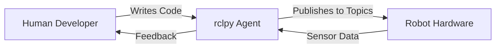

# Module 01: The Robotic Nervous System (ROS 2)

## Overview

Welcome to **Module 01**! In this module, you'll learn the foundational middleware layer that enables communication between AI agents and physical robots. **ROS 2 (Robot Operating System 2)** is the industry-standard framework for building robotics applications.

---

## Learning Objectives

By completing this module, you will be able to:

✅ **Create ROS 2 nodes** that publish and subscribe to topics
✅ **Call ROS 2 services** and trigger actions from Python code
✅ **Build and visualize** a bipedal URDF model in RViz
✅ **Explain ROS 2 architecture** (nodes, topics, services, actions) with practical examples

---

## Prerequisites

Before starting this module:

- ✅ **Python 3.10+** installed with basic programming knowledge
- ✅ **Ubuntu 22.04 LTS** environment (native, VM, or WSL2)
- ✅ **ROS 2 Humble** installed ([installation guide](https://docs.ros.org/en/humble/Installation.html))
- ✅ **Basic command-line proficiency**

:::tip System Check
Verify ROS 2 installation:
```bash
source /opt/ros/humble/setup.bash
ros2 --version
```
Expected output: `ros2 cli version x.x.x`
:::

---

## Module Structure

This module contains 6 pages:

| Page | Topic | Type |
|------|-------|------|
| 01 | ROS 2 Architecture | Concept |
| 02 | Python Bridging with rclpy | Concept |
| 03 | URDF Anatomy | Concept |
| 04 | Hello Robot Node | Hands-On |
| 05 | Bipedal URDF Model | Hands-On |
| 06 | Checkpoint | Validation |

---

## Module Deliverable

By the end of this module, you will create:

### 1. Hello Robot Node
A functional ROS 2 node that:
- Publishes "Hello, Robot!" messages to a topic every second
- Demonstrates publisher-subscriber communication
- Logs activity to the console

### 2. Bipedal URDF Model
A 6-DOF humanoid robot model with:
- Torso, left/right legs, head
- 6 joints (2 hips, 2 knees, 1 neck, 1 head pivot)
- Visual meshes for 3D visualization
- Verified to load in RViz without errors

---

## Estimated Completion Time

⏱️ **3 hours** (including hands-on exercises and checkpoint)

---

## Human-Agent-Robot Symbiosis in Module 01

This module demonstrates the partnership model:

- **Human**: You design robot behavior (what the robot should do)
- **Agent (rclpy)**: Python code orchestrates communication between components
- **Robot**: Physical hardware receives commands via ROS 2 topics/services



---

## Ready to Start?

Begin with **Page 01: ROS 2 Architecture** to understand the core communication patterns.

[Continue to ROS 2 Architecture →](01-ros2-architecture.md)
