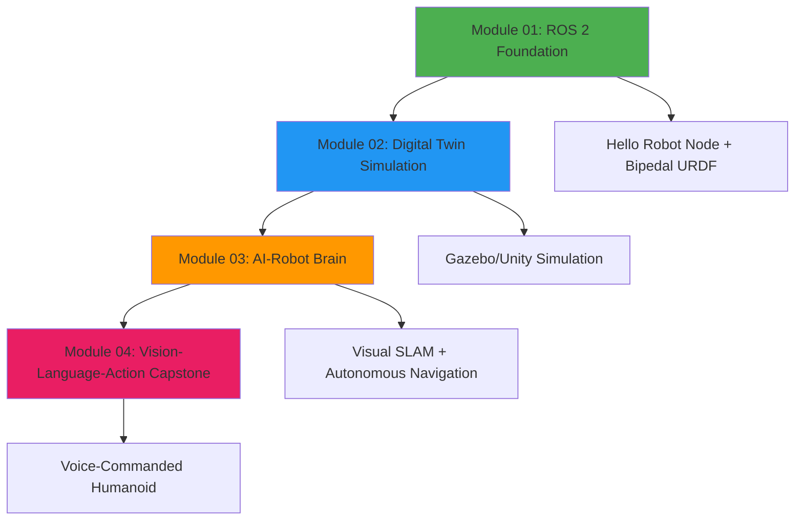

# Physical AI & Humanoid Robotics

**An AI-Native Textbook for the Future of Work**

Welcome to the comprehensive curriculum designed to teach the intersection of **artificial intelligence, software agents, and physical robotics**. This textbook emphasizes the partnership between humans, AI agents, and humanoid robots—preparing you for careers in the rapidly evolving field of Physical AI.

---

## Learning Path

---

## Course Overview

### Module 01: The Robotic Nervous System (ROS 2)

**Duration**: ~3 hours | **Priority**: P1 (MVP)

Establish the middleware foundation for robot control using **ROS 2 Humble**. Learn how nodes, topics, services, and actions enable communication between AI agents and robot hardware.

**Deliverable**: Create a "Hello Robot" node and build a 6-DOF bipedal URDF model visualized in RViz.

[Start Module 01 →](robotic-nervous-system/)

---

### Module 02: The Digital Twin (Gazebo & Unity)

**Duration**: ~4 hours | **Priority**: P2

Master physics simulation and high-fidelity environment building with **Gazebo** and **Unity**. Configure sensor plugins (LiDAR, depth cameras, IMU) and access real-time data streams.

**Deliverable**: A simulation environment where robots spawn with realistic physics and sensor data flows to ROS 2 topics.

_Coming soon..._

---

### Module 03: The AI-Robot Brain (NVIDIA Isaac)

**Duration**: ~5 hours | **Priority**: P3

Implement advanced perception and Visual SLAM using **NVIDIA Isaac Sim** and **Isaac ROS**. Configure **Nav2** for bipedal path planning and autonomous navigation.

**Deliverable**: A robot that generates synthetic training data, maps a room, and autonomously navigates from point A to B.

_Coming soon..._

---

### Module 04: Vision-Language-Action (VLA)

**Duration**: ~6 hours | **Priority**: P4 (Capstone)

Build the complete **Human-Agent-Robot Symbiosis** pipeline. Integrate **OpenAI Whisper** for voice transcription, **LLMs** for reasoning, and **ROS 2** for robot execution.

**Deliverable**: "The Autonomous Humanoid" - a voice-commanded robot that translates natural language into physical actions.

_Coming soon..._

---

## Prerequisites

Before starting this curriculum, ensure you have:

- **Python 3.10+** installed with basic programming knowledge (variables, functions, loops)
- **Ubuntu 22.04 LTS** environment (native, VM, or WSL2 for Windows users)
- **8GB RAM minimum** (16GB recommended for Module 03)
- **Basic command-line proficiency** (cd, ls, mkdir, running scripts)

**Optional for Module 03**:
- **NVIDIA GPU** with 6GB VRAM for Isaac Sim (alternatives provided for CPU-only systems)

---

## Learning Approach

This textbook follows **AI-Native Pedagogy** principles:

✅ **Practical Rigor**: Every concept includes executable code examples with setup instructions, run commands, and expected outputs

✅ **Human-Agent-Robot Symbiosis**: Content demonstrates how humans guide, AI agents orchestrate, and robots execute

✅ **Modular Structure**: Each module is self-contained with clear learning objectives and prerequisites

✅ **Future-Ready Skills**: Aligned with Panaversity's "Future of Work" demands—agentic AI, humanoid robotics, edge computing

---

## How to Use This Textbook

1. **Sequential Learning**: Complete modules in order (01 → 02 → 03 → 04) for best experience
2. **Hands-On Practice**: Run every code example locally—learning happens through doing
3. **Checkpoint Validation**: Complete validation exercises at the end of each module
4. **AI-Assisted Study**: Use Claude Code/Agents to navigate content, ask questions, and debug issues

---

## Support & Resources

- **ROS 2 Documentation**: [docs.ros.org/en/humble](https://docs.ros.org/en/humble/)
- **NVIDIA Isaac**: [developer.nvidia.com/isaac-ros](https://developer.nvidia.com/isaac-ros)
- **Gazebo**: [gazebosim.org](https://gazebosim.org/)
- **Docusaurus**: [docusaurus.io](https://docusaurus.io/)

---

## Ready to Begin?

Start with **Module 01: The Robotic Nervous System** to build your foundation in ROS 2 middleware.

[Begin Learning →](robotic-nervous-system/)
