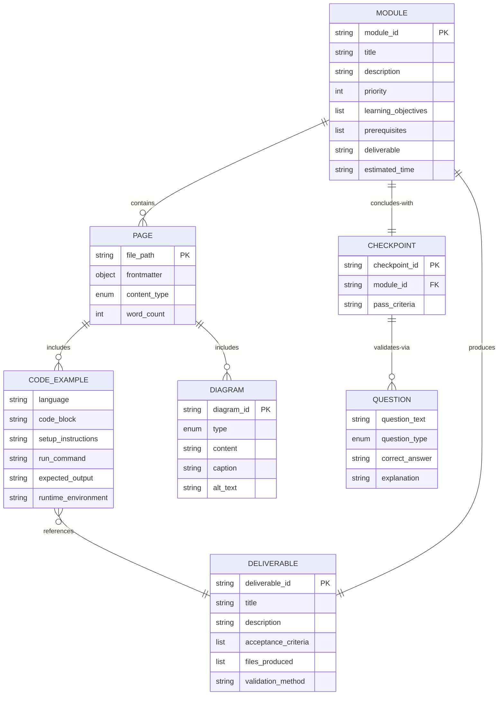

# Data Model: Content Entities

**Feature**: Textbook Content Modules
**Date**: 2025-12-26
**Phase**: 1 (Design & Contracts)

## Purpose

Define the structure and relationships of content entities that comprise the Physical AI & Humanoid Robotics textbook. This model guides content creation, ensures consistency across modules, and enforces Constitution principles.

---

## Entity Definitions

### 1. Module

**Definition**: A self-contained learning unit covering a major curriculum topic, deployed as a Docusaurus subdirectory.

**Attributes**:
- `module_id`: String (e.g., "01-robotic-nervous-system")
- `title`: String (e.g., "The Robotic Nervous System (ROS 2)")
- `description`: String (1-2 sentences summarizing module content)
- `priority`: Integer (P1, P2, P3, P4 from spec user stories)
- `learning_objectives`: List[String] (3-5 measurable outcomes)
- `prerequisites`: List[String] (prior modules or foundational knowledge required)
- `deliverable`: String (hands-on artifact learners create, e.g., "Hello Robot node + bipedal URDF")
- `pages`: List[Page] (ordered collection of content pages)
- `estimated_completion_time`: String (e.g., "3 hours")

**Relationships**:
- Contains many `Page` entities
- Contains many `CodeExample` entities (via pages)
- Contains many `Diagram` entities (via pages)
- Contains one `Checkpoint` entity (final validation)

**Validation Rules** (from spec FR-001, FR-003, FR-004):
- `module_id` must match directory name pattern `0X-kebab-case/`
- `learning_objectives` must be stated in index.md first section
- `prerequisites` must link to prior module index.md files
- `deliverable` must be described in index.md

**Example**:
```yaml
module_id: "01-robotic-nervous-system"
title: "The Robotic Nervous System (ROS 2)"
description: "Establish the middleware foundation for robot control using ROS 2 architecture, Python bridging, and URDF modeling."
priority: 1
learning_objectives:
  - "Create ROS 2 nodes that publish and subscribe to topics"
  - "Call ROS 2 services and trigger actions from Python"
  - "Build and visualize a bipedal URDF model in RViz"
prerequisites:
  - "Python 3.10+ installed"
  - "Basic programming knowledge (variables, functions, loops)"
deliverable: "A functional 'Hello Robot' node and a basic URDF bipedal model"
estimated_completion_time: "3 hours"
```

---

### 2. Page

**Definition**: A single Markdown/MDX file within a module, covering a specific concept or hands-on activity.

**Attributes**:
- `file_path`: String (relative to `docs/`, e.g., "01-robotic-nervous-system/02-python-bridging.md")
- `frontmatter`: YAML object (title, description, keywords, sidebar_position)
- `content_type`: Enum["concept", "hands-on", "checkpoint"]
- `word_count`: Integer (target: 800-1500 words per concept page, 500-1000 for hands-on)
- `code_examples`: List[CodeExample]
- `diagrams`: List[Diagram]
- `external_links`: List[URL] (ROS 2 docs, NVIDIA docs, etc.)

**Relationships**:
- Belongs to one `Module`
- Contains many `CodeExample` entities
- Contains many `Diagram` entities

**Validation Rules** (from spec FR-002, FR-011, FR-012, FR-013):
- `frontmatter.sidebar_position` must match numeric prefix in filename (e.g., `02-python-bridging.md` → `sidebar_position: 2`)
- `frontmatter` must include: `title`, `description`, `keywords`, `sidebar_position`
- Internal links must use relative paths (e.g., `[Module 01](../01-robotic-nervous-system/index.md)`)
- External links must include `target="_blank"` attribute
- All headings must follow hierarchy (H1 → H2 → H3, no skipped levels)

**Example Frontmatter**:
```yaml
---
title: "Python Bridging with rclpy"
description: "Learn how to connect AI Agents with robot hardware using Python's rclpy library for ROS 2 communication."
keywords: ["ROS 2", "rclpy", "Python", "nodes", "topics", "services"]
sidebar_position: 2
---
```

---

### 3. CodeExample

**Definition**: An executable code snippet embedded in a page, demonstrating a concept or technique.

**Attributes**:
- `language`: String (e.g., "python", "cpp", "yaml", "xml")
- `code_block`: String (the actual code with syntax highlighting)
- `setup_instructions`: String (prerequisites, package installations, environment setup)
- `run_command`: String (exact command to execute code, e.g., `ros2 run my_package hello_robot`)
- `expected_output`: String (what learners should see when code runs successfully)
- `runtime_environment`: String (e.g., "ROS 2 Humble on Ubuntu 22.04")
- `file_location`: Optional[String] (path in `static/code/` if downloadable bundle provided)

**Relationships**:
- Belongs to one `Page`
- May reference `Deliverable` entity (if code produces module deliverable)

**Validation Rules** (from spec FR-005, FR-006, FR-007):
- Every major concept page must include at least 1 `CodeExample`
- `language` must be specified in Markdown code fence (e.g., ` ```python `)
- `setup_instructions` must be included before code block
- `expected_output` must be shown after code block (in blockquote or separate section)
- Code must be tested and guaranteed to execute without errors (FR-007)

**Example**:
```markdown
### Code Example: Hello Robot Node

**Setup Instructions**:
1. Source ROS 2 environment: `source /opt/ros/humble/setup.bash`
2. Create workspace: `mkdir -p ~/ros2_ws/src && cd ~/ros2_ws/src`
3. Create package: `ros2 pkg create --build-type ament_python hello_robot`

**Code** (`~/ros2_ws/src/hello_robot/hello_robot/hello_robot_node.py`):

​```python
import rclpy
from rclpy.node import Node
from std_msgs.msg import String

class HelloRobotNode(Node):
    def __init__(self):
        super().__init__('hello_robot')
        self.publisher = self.create_publisher(String, 'hello_topic', 10)
        self.timer = self.create_timer(1.0, self.publish_message)
        self.get_logger().info('Hello Robot Node started!')

    def publish_message(self):
        msg = String()
        msg.data = 'Hello, Robot!'
        self.publisher.publish(msg)
        self.get_logger().info(f'Published: {msg.data}')

def main():
    rclpy.init()
    node = HelloRobotNode()
    rclpy.spin(node)
    rclpy.shutdown()

if __name__ == '__main__':
    main()
​```

**Run Command**:
```bash
cd ~/ros2_ws
colcon build --packages-select hello_robot
source install/setup.bash
ros2 run hello_robot hello_robot_node
```

**Expected Output**:
```
[INFO] [hello_robot]: Hello Robot Node started!
[INFO] [hello_robot]: Published: Hello, Robot!
[INFO] [hello_robot]: Published: Hello, Robot!
...
```

**Runtime Environment**: ROS 2 Humble on Ubuntu 22.04
```

---

### 4. Diagram

**Definition**: A visual representation (Mermaid syntax or SVG) illustrating architecture, workflows, or data flow.

**Attributes**:
- `diagram_id`: String (e.g., "ros2-architecture-graph")
- `type`: Enum["mermaid", "svg", "png"]
- `content`: String (Mermaid code) or URL (path to SVG/PNG in `static/img/`)
- `caption`: String (describes diagram purpose)
- `alt_text`: String (accessibility description for screen readers, WCAG 2.1 AA requirement)

**Relationships**:
- Belongs to one `Page`

**Validation Rules** (from spec FR-011, SC-009):
- Mermaid diagrams embedded directly in MDX with ` ```mermaid ` fence
- SVG/PNG files stored in `static/img/` with descriptive filenames
- All diagrams must have `alt_text` for accessibility
- Caption must be provided below diagram

**Example (Mermaid)**:
```markdown
### ROS 2 Architecture: Nodes and Topics

​```mermaid
graph LR
    A[Hello Robot Node] -->|publishes| B[/hello_topic/]
    B -->|subscribes| C[Listener Node]
    A -.->|logs| D[ROS 2 Logger]
    C -.->|logs| D
​```

*Figure 1: ROS 2 publish-subscribe communication pattern between Hello Robot Node and Listener Node.*

**Alt Text**: "Diagram showing Hello Robot Node publishing messages to hello_topic, which Listener Node subscribes to, with both nodes logging to ROS 2 Logger."
```

---

### 5. Deliverable

**Definition**: A hands-on artifact that learners create to demonstrate module mastery.

**Attributes**:
- `deliverable_id`: String (e.g., "module01-hello-robot")
- `title`: String (e.g., "Hello Robot Node")
- `description`: String (what the artifact does)
- `acceptance_criteria`: List[String] (measurable validation criteria from spec acceptance scenarios)
- `files_produced`: List[String] (e.g., ["hello_robot_node.py", "package.xml", "setup.py"])
- `validation_method`: String (how to verify deliverable works, e.g., "Run node and observe console output")

**Relationships**:
- Belongs to one `Module`
- Referenced by one or more `CodeExample` entities

**Validation Rules** (from spec FR-008):
- Each module must have at least one `Deliverable` described in index.md or final hands-on page
- `acceptance_criteria` must map to spec user story acceptance scenarios

**Example**:
```yaml
deliverable_id: "module01-hello-robot"
title: "Hello Robot Node"
description: "A ROS 2 node that publishes 'Hello, Robot!' messages to a topic every second and logs each publication."
acceptance_criteria:
  - "Node starts without errors and logs 'Hello Robot Node started!'"
  - "Messages published to /hello_topic visible with `ros2 topic echo /hello_topic`"
  - "Console logs show 'Published: Hello, Robot!' every second"
files_produced:
  - "hello_robot_node.py"
  - "package.xml"
  - "setup.py"
validation_method: "Run `ros2 run hello_robot hello_robot_node` and verify console output matches expected output"
```

---

### 6. Checkpoint

**Definition**: A validation exercise (quiz, coding challenge, deliverable review) at the end of each module confirming learning objectives were achieved.

**Attributes**:
- `checkpoint_id`: String (e.g., "module01-checkpoint")
- `module_id`: String (foreign key to parent module)
- `questions`: List[Question] (quiz questions or coding challenges)
- `pass_criteria`: String (e.g., "Correctly answer 4/5 questions or complete coding challenge")

**Question Sub-Entity**:
- `question_text`: String (e.g., "What is the difference between a ROS 2 topic and service?")
- `question_type`: Enum["multiple_choice", "short_answer", "coding_challenge"]
- `correct_answer`: String (for validation guidance, not shown to learners initially)
- `explanation`: String (why the answer is correct, shown after attempt)

**Relationships**:
- Belongs to one `Module`

**Validation Rules** (from spec FR-010):
- Each module must conclude with one `Checkpoint` page (e.g., `06-checkpoint.md`)
- Questions must validate learning objectives from module index.md
- Coding challenges must be executable and verifiable

**Example**:
```yaml
checkpoint_id: "module01-checkpoint"
module_id: "01-robotic-nervous-system"
questions:
  - question_text: "What is the primary role of rclpy in ROS 2?"
    question_type: "multiple_choice"
    options:
      - "A) Compile C++ nodes"
      - "B) Bridge Python code with ROS 2 communication (correct)"
      - "C) Visualize robot models"
      - "D) Simulate physics"
    correct_answer: "B"
    explanation: "rclpy is the Python client library for ROS 2, enabling Python scripts to create nodes, publish/subscribe to topics, call services, and trigger actions."

  - question_text: "Create a ROS 2 subscriber node that listens to /hello_topic and logs each message."
    question_type: "coding_challenge"
    correct_answer: "Code must include Node subclass, create_subscription call, and callback function logging message data"
    explanation: "A valid subscriber node requires inheriting from rclpy.node.Node, using create_subscription() to listen to /hello_topic, and implementing a callback that processes incoming messages."

pass_criteria: "Complete 4/5 questions correctly or successfully implement the coding challenge"
```

---

## Entity Relationships Diagram



---

## Content Constraints

### Constitution Principle Enforcement

**Principle I (Human-Agent-Robot Symbiosis)**:
- Each module must include at least one `CodeExample` demonstrating human-agent-robot integration
- Module 04 `Deliverable` must show complete voice (human) → LLM (agent) → ROS 2 (robot) pipeline

**Principle II (AI-Native Pedagogy)**:
- All `Page` entities must include structured YAML `frontmatter` with keywords for AI navigation
- Module content must be parseable by Claude Code/Agents (Markdown format, clear section headings)

**Principle III (Practical Rigor)**:
- Each module must contain minimum 3 `CodeExample` entities (per spec SC-002)
- Every `CodeExample` must include `setup_instructions`, `run_command`, and `expected_output` (per spec FR-005, FR-006, FR-007)

**Principle V (Modular Structure)**:
- Each `Module` must declare `learning_objectives` and `prerequisites` in index.md
- Modules must be independently completable given prerequisites (validated via `Checkpoint`)

**Principle VII (Zero-Error Deployment)**:
- All `Page` internal links must be validated (no broken links)
- All `Diagram` entities must have `alt_text` for WCAG 2.1 AA compliance

---

## Next Steps

Data model defined. Proceed to create:
1. **contracts/module-page-schema.yaml**: YAML frontmatter schema
2. **contracts/code-example-template.md**: Template for code examples
3. **contracts/checkpoint-template.md**: Template for checkpoint exercises
