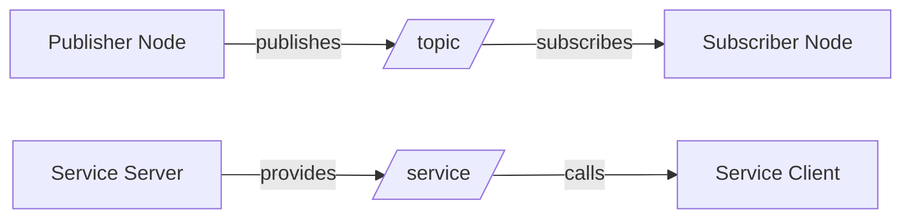

# Quickstart Guide: Content Author Workflow

**Feature**: Textbook Content Modules
**Audience**: Content authors creating educational pages for Physical AI & Humanoid Robotics textbook
**Date**: 2025-12-26

---

## Purpose

This guide helps content authors set up the Docusaurus environment, create module pages following Constitution principles, and deploy content to GitHub Pages with zero errors.

---

## Prerequisites

- **Node.js**: 18.x or 20.x LTS (check: `node --version`)
- **npm**: 9.x+ (check: `npm --version`)
- **Git**: For version control and GitHub Pages deployment
- **Text Editor**: VS Code recommended (with Markdown/MDX extensions)

---

## Quick Start (5 Minutes)

### 1. Clone Repository and Install Dependencies

```bash
# Clone the repository
git clone <repository-url>
cd book

# Install Docusaurus and dependencies
npm install

# Start local development server
npm start
```

**Expected**: Browser opens at `http://localhost:3000` showing the textbook homepage.

---

### 2. Create Your First Module Page

**Example**: Add a new page to Module 01 (ROS 2 Foundation)

```bash
# Navigate to Module 01 directory
cd docs/01-robotic-nervous-system

# Create new page (use numeric prefix for ordering)
touch 07-new-topic.md
```

**Edit `07-new-topic.md`** with required frontmatter:

```markdown
---
title: "Your Page Title"
description: "1-2 sentence summary of page content (max 160 chars)"
keywords: ["ROS 2", "Python", "your", "keywords", "here"]
sidebar_position: 7
---

# Your Page Title

Your content here...
```

**Save and check**: Docusaurus dev server auto-reloads. Visit `http://localhost:3000` and navigate to Module 01 to see your new page in the sidebar.

---

### 3. Validate and Deploy

```bash
# Build for production (catches errors)
npm run build

# Test production build locally
npm run serve

# Deploy to GitHub Pages
npm run deploy
```

**Expected**: Build completes with zero errors, site accessible at GitHub Pages URL.

---

## Detailed Workflow

### Step 1: Environment Setup

#### Install Node.js (if not installed)

**Ubuntu/WSL2**:
```bash
curl -fsSL https://deb.nodesource.com/setup_20.x | sudo -E bash -
sudo apt-get install -y nodejs
```

**macOS** (Homebrew):
```bash
brew install node@20
```

**Windows**:
Download installer from [nodejs.org](https://nodejs.org/)

#### Install Docusaurus Dependencies

```bash
cd book
npm install
```

**Packages installed**:
- `@docusaurus/core`: Docusaurus framework
- `@docusaurus/theme-mermaid`: Mermaid diagram support
- `@docusaurus/plugin-ideal-image`: Optimized image loading
- Additional plugins per research.md decisions

---

### Step 2: Understanding Project Structure

```
book/
├── docs/                          # Content directory (YOUR WORK HERE)
│   ├── 01-robotic-nervous-system/ # Module 01
│   ├── 02-digital-twin/           # Module 02
│   ├── 03-ai-robot-brain/         # Module 03
│   └── 04-vision-language-action/ # Module 04
├── static/                        # Static assets
│   ├── img/                       # Diagrams, screenshots
│   └── code/                      # Downloadable code bundles
├── docusaurus.config.js           # Docusaurus configuration
├── sidebars.js                    # Sidebar navigation
├── package.json                   # Dependencies
└── specs/                         # Planning docs (reference only)
    └── 001-textbook-content-modules/
        ├── spec.md                # Feature specification
        ├── plan.md                # Implementation plan
        ├── research.md            # Technology decisions
        ├── data-model.md          # Content entities
        ├── contracts/             # Templates and schemas
        └── quickstart.md          # This file
```

**Your focus**: `docs/` directory and `static/` assets.

---

### Step 3: Creating Module Pages

#### A. Follow Naming Convention

**Pattern**: `XX-kebab-case-title.md` where XX is sidebar position (01, 02, 03...)

**Examples**:
- `docs/01-robotic-nervous-system/01-ros2-architecture.md`
- `docs/01-robotic-nervous-system/02-python-bridging.md`
- `docs/02-digital-twin/index.md` (module overview, position 0)

#### B. Add Required Frontmatter

**Refer to**: `specs/001-textbook-content-modules/contracts/module-page-schema.yaml`

**Template**:
```yaml
---
title: "Your Page Title"
description: "1-2 sentence summary (max 160 chars for SEO)"
keywords: ["keyword1", "keyword2", "keyword3", "keyword4", "keyword5"]
sidebar_position: XX
---
```

**Validation**:
- Title: 3-80 characters
- Description: 10-160 characters
- Keywords: 5-10 items
- `sidebar_position` must match filename prefix

#### C. Write Content

**Structure** (recommended):

```markdown
# Page Title

Brief introduction (1-2 paragraphs explaining what this page covers).

## Section 1: Concept Explanation

Explain the concept with clear examples.

### Subsection 1.1

Details...

## Section 2: Hands-On Example

Follow code example template (see below).

## Summary

Recap key points in 3-5 bullet points.

## Next Steps

Link to next page or checkpoint.
```

**Best Practices**:
- Use heading hierarchy (H1 → H2 → H3, no skipped levels)
- Keep paragraphs short (3-5 sentences)
- Use bullet points for lists
- Include diagrams for complex concepts
- Link to external docs with `target="_blank"`

---

### Step 4: Adding Code Examples

**Refer to**: `specs/001-textbook-content-modules/contracts/code-example-template.md`

**Minimum Requirements** (Constitution Principle III):
- Setup instructions (prerequisites, environment)
- Code block with language tag
- Run command (exact, copy-pasteable)
- Expected output (actual console output)
- Validation method (how to verify success)

**Example**:

````markdown
### Code Example: Create a ROS 2 Publisher

**Setup Instructions**:

1. Source ROS 2: `source /opt/ros/humble/setup.bash`
2. Create package: `ros2 pkg create --build-type ament_python my_publisher`

**Environment**: ROS 2 Humble on Ubuntu 22.04

**Code** (`my_publisher/my_publisher/publisher_node.py`):

```python
import rclpy
from rclpy.node import Node
from std_msgs.msg import String

class PublisherNode(Node):
    def __init__(self):
        super().__init__('my_publisher')
        self.publisher = self.create_publisher(String, 'my_topic', 10)
        self.timer = self.create_timer(1.0, self.publish_message)

    def publish_message(self):
        msg = String()
        msg.data = 'Hello from publisher!'
        self.publisher.publish(msg)
        self.get_logger().info(f'Published: {msg.data}')

def main():
    rclpy.init()
    node = PublisherNode()
    rclpy.spin(node)
    rclpy.shutdown()
```

**Run Command**:

```bash
cd ~/ros2_ws
colcon build --packages-select my_publisher
source install/setup.bash
ros2 run my_publisher publisher_node
```

**Expected Output**:

```
[INFO] [my_publisher]: Published: Hello from publisher!
[INFO] [my_publisher]: Published: Hello from publisher!
...
```
````

---

### Step 5: Creating Mermaid Diagrams

**Docusaurus supports Mermaid natively** (configured in `docusaurus.config.js`).

**Diagram Types**:
- **Graph**: Node relationships (e.g., ROS 2 node communication)
- **Sequence**: Message flows (e.g., request-reply pattern)
- **Flowchart**: Decision trees (e.g., navigation algorithm)

**Example: ROS 2 Node Graph**:

````markdown
### ROS 2 Architecture Diagram



*Figure 1: ROS 2 communication patterns showing topics and services.*

**Alt Text**: "Diagram showing ROS 2 publisher-subscriber topic communication and service client-server pattern."
````

**Alt Text Requirement** (WCAG 2.1 AA): Always provide alt text below diagram for accessibility.

**Mermaid Syntax Reference**: [mermaid.js.org](https://mermaid.js.org/)

---

### Step 6: Adding Static Assets

#### Images/Diagrams (SVG/PNG)

**Storage**: `static/img/`

**Example**:
```bash
# Add diagram to static directory
cp ~/Downloads/gazebo-screenshot.png static/img/module02-gazebo-screenshot.png
```

**Reference in Markdown**:
```markdown


*Figure 2: Gazebo simulation environment with bipedal robot spawned.*

**Alt Text**: "Screenshot of Gazebo showing a bipedal humanoid robot standing in an empty world with grid floor."
```

**Best Practices**:
- Use descriptive filenames (e.g., `module02-gazebo-screenshot.png`)
- Optimize images (compress PNGs, use SVG when possible)
- Always include alt text

#### Downloadable Code Bundles

**Storage**: `static/code/moduleXX-example-name/`

**Example**:
```bash
# Create code bundle directory
mkdir -p static/code/module01-hello-robot
cd static/code/module01-hello-robot

# Add files (package structure)
touch package.xml setup.py README.md
mkdir -p hello_robot
touch hello_robot/__init__.py hello_robot/hello_robot_node.py
```

**Reference in Markdown**:
```markdown
**Download Complete Example**: [module01-hello-robot](../../static/code/module01-hello-robot/)

This example includes:
- Full ROS 2 package structure
- README with setup instructions
- Launch files (if applicable)
```

---

### Step 7: Creating Checkpoints

**Refer to**: `specs/001-textbook-content-modules/contracts/checkpoint-template.md`

**Checkpoint Requirements** (per spec FR-010):
- Review learning objectives from module index.md
- Include 3-5 exercises (multiple choice, short answer, coding challenges)
- Provide deliverable verification steps
- Define pass criteria (e.g., 80% quiz score)

**Example Checkpoint Structure**:

```markdown
---
title: "Module 01 Checkpoint"
description: "Validation exercises for ROS 2 Foundation module."
keywords: ["checkpoint", "validation", "ROS 2", "quiz"]
sidebar_position: 6
---

# Module 01 Checkpoint

**Purpose**: Validate ROS 2 Foundation learning objectives.

**Time Required**: 20 minutes

**Pass Criteria**: Complete 4/5 quiz questions correctly OR successfully implement the coding challenge.

---

## Learning Objectives Review

By completing this module, you should be able to:
- Create ROS 2 nodes that publish and subscribe to topics
- Call ROS 2 services and trigger actions from Python
- Build and visualize a bipedal URDF model in RViz

---

## Exercise 1: Multiple Choice

### Question 1.1: What is rclpy?

**A)** A C++ compiler for ROS 2
**B)** Python client library for ROS 2 communication (correct)
**C)** A 3D visualization tool
**D)** A physics simulator

<details>
<summary><strong>Click to reveal answer</strong></summary>

**Correct Answer**: B

**Explanation**: rclpy is the Python client library...

**Reference**: [Python Bridging](./02-python-bridging.md)

</details>

---

## Exercise 2: Coding Challenge

**Objective**: Create a subscriber node...

[Follow coding challenge template]

---

## Exercise 3: Deliverable Verification

**Deliverable**: Hello Robot Node + Bipedal URDF

**Verification Steps**:

### Step 1: Verify Hello Robot Node
- Run: `ros2 run hello_robot hello_robot_node`
- ✅ **Pass if**: Console shows "Published: Hello, Robot!" every second

[Follow deliverable verification template]
```

---

### Step 8: Local Testing

#### Start Development Server

```bash
npm start
```

**What it does**:
- Starts local server at `http://localhost:3000`
- Enables hot-reload (changes reflect immediately)
- Shows build errors in terminal

**Test**:
1. Navigate to your module in sidebar
2. Verify page appears correctly
3. Check internal links work
4. Verify code blocks have syntax highlighting
5. Test Mermaid diagrams render

#### Build for Production

```bash
npm run build
```

**What it does**:
- Compiles all pages for production
- Validates all links (catches 404 errors)
- Checks frontmatter schema
- Minifies assets

**Expected**: Build completes with **zero errors and zero warnings** (Constitution Principle VII: Zero-Error Deployment).

**Common Errors**:
- **Missing frontmatter**: Add required fields (title, description, keywords, sidebar_position)
- **Broken links**: Fix relative paths (use `../` to navigate between modules)
- **Invalid Mermaid syntax**: Check [Mermaid docs](https://mermaid.js.org/) for correct syntax

---

### Step 9: Deployment to GitHub Pages

#### Configure GitHub Pages (One-Time Setup)

1. Edit `docusaurus.config.js`:
   ```javascript
   const config = {
     url: 'https://<your-username>.github.io',
     baseUrl: '/book/',  // Replace 'book' with your repo name
     organizationName: '<your-username>',
     projectName: 'book',
     // ...
   };
   ```

2. Commit configuration:
   ```bash
   git add docusaurus.config.js
   git commit -m "Configure GitHub Pages deployment"
   git push
   ```

#### Deploy

```bash
npm run deploy
```

**What it does**:
- Builds site for production
- Pushes to `gh-pages` branch
- Triggers GitHub Pages deployment

**Expected**: After 1-2 minutes, site accessible at `https://<your-username>.github.io/book/`

**Verify Deployment**:
1. Visit GitHub Pages URL
2. Navigate to all modules
3. Test links, code examples, diagrams
4. Verify mobile responsiveness

---

## Content Validation Checklist

Before publishing content, verify:

### Page Requirements
- [ ] Required frontmatter present (title, description, keywords, sidebar_position)
- [ ] `sidebar_position` matches filename prefix
- [ ] Description under 160 characters
- [ ] 5-10 keywords provided
- [ ] Heading hierarchy correct (no skipped levels)

### Code Examples
- [ ] Setup instructions included
- [ ] Runtime environment specified
- [ ] Code has language tag (` ```python `)
- [ ] Run command provided (exact, copy-pasteable)
- [ ] Expected output shown
- [ ] Code tested and executes without errors (FR-007)

### Diagrams
- [ ] Mermaid diagrams render correctly
- [ ] SVG/PNG images load
- [ ] Alt text provided for all visual elements
- [ ] Captions describe diagram purpose

### Links
- [ ] Internal links use relative paths
- [ ] External links include `target="_blank"`
- [ ] No broken links (checked by `npm run build`)

### Accessibility (WCAG 2.1 AA)
- [ ] All images have alt text
- [ ] Proper heading hierarchy
- [ ] Color contrast sufficient (Docusaurus default theme compliant)

### Constitution Compliance
- [ ] At least 3 code examples per module (Principle III)
- [ ] Human-Agent-Robot Symbiosis demonstrated (Principle I)
- [ ] Learning objectives stated (Principle V)
- [ ] Prerequisites declared (Principle V)

---

## Troubleshooting

### Issue: `npm install` fails with permission errors

**Solution**:
```bash
# macOS/Linux
sudo chown -R $USER ~/.npm
npm install

# Windows
# Run terminal as Administrator, then npm install
```

### Issue: Dev server doesn't hot-reload

**Solution**:
```bash
# Stop server (Ctrl+C)
# Clear cache
npm run clear
npm start
```

### Issue: Mermaid diagram doesn't render

**Solution**:
- Check syntax: [Mermaid Live Editor](https://mermaid.live/)
- Ensure code fence uses ` ```mermaid `, not ` ```mermaidjs `
- Verify `docusaurus.config.js` has `@docusaurus/theme-mermaid` enabled

### Issue: Build fails with "Cannot find module"

**Solution**:
```bash
# Reinstall dependencies
rm -rf node_modules package-lock.json
npm install
npm run build
```

### Issue: GitHub Pages shows 404

**Solution**:
- Verify `baseUrl` in `docusaurus.config.js` matches repo name
- Check GitHub repo settings → Pages → Source is set to `gh-pages` branch
- Wait 2-3 minutes for deployment to complete

---

## Advanced Workflows

### Using MDX (Advanced Markdown)

Docusaurus supports MDX for interactive components:

```mdx
import Tabs from '@theme/Tabs';
import TabItem from '@theme/TabItem';

<Tabs>
  <TabItem value="python" label="Python" default>

    ```python
    print("Hello from Python!")
    ```

  </TabItem>
  <TabItem value="cpp" label="C++">

    ```cpp
    std::cout << "Hello from C++!" << std::endl;
    ```

  </TabItem>
</Tabs>
```

**Use Cases**: Show code examples in multiple languages side-by-side.

### Custom Components

Create reusable components in `src/components/` for repeated patterns (e.g., "Prerequisites" callout box).

---

## Getting Help

- **Docusaurus Docs**: [docusaurus.io/docs](https://docusaurus.io/docs)
- **Mermaid Syntax**: [mermaid.js.org](https://mermaid.js.org/)
- **ROS 2 Docs**: [docs.ros.org](https://docs.ros.org/en/humble/)
- **Project Spec**: See `specs/001-textbook-content-modules/spec.md` for requirements
- **Templates**: See `specs/001-textbook-content-modules/contracts/` for code example and checkpoint templates

---

## Summary

**Content Author Workflow**:
1. Create page with required frontmatter
2. Write content following structure (concept → hands-on → summary)
3. Add code examples (setup, code, run, output)
4. Add diagrams (Mermaid or static images with alt text)
5. Test locally (`npm start`)
6. Build (`npm run build`) → fix errors
7. Deploy (`npm run deploy`) → verify on GitHub Pages

**Key Principles**:
- **Practical Rigor**: Every concept needs executable code (Constitution Principle III)
- **Zero-Error Deployment**: Build must pass with no errors/warnings (Constitution Principle VII)
- **Accessibility**: All visuals need alt text (WCAG 2.1 AA)
- **Modular Structure**: Declare learning objectives and prerequisites (Constitution Principle V)
